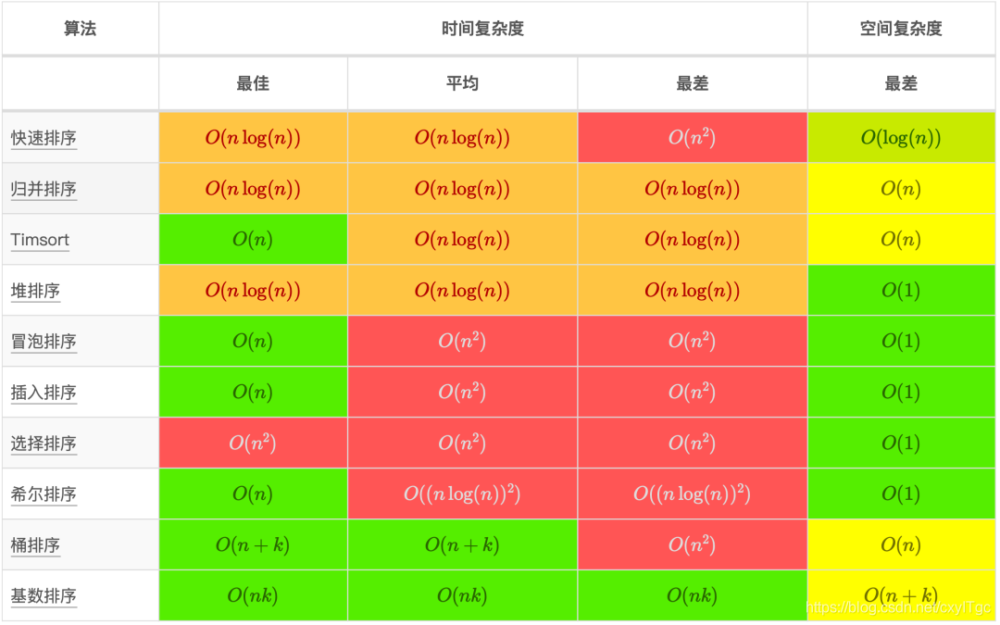

# 根据数据范围推测算法复杂度

#### 1. $N <= 20 \to O(2^n)$

> 指数阶（几乎所有算法都可以用）

#### 2. $20 < N <= 100 \to O(n^3)$

> 三层循环，例：三维DP

#### 3. $100 < N <= 10^4 \to O(n^2)$

> 二层循环，例：二维dp

#### 4. $10^4 < N <= 10^5 \to  O(nlogn)$

> loop里嵌套对数阶；优化的排序算法：堆、归并、快排（平均）
>
> ```python
>for m in range(n):
> i = 1
> while i<=n: # O(logN)
>    i*=2
>   ```



#### 5. $10^5 < N <= 10^8 \to O(n)$

> 线性扫描、树的DFS/BFS遍历

#### 6. $N > 10^8 \to O(logn)$

> 二分搜索、树

#### 算法与复杂度

##### dfs/bfs:

>  时间复杂度： O(|E|+|V|) 使用邻接表，O(|V|^2)使用邻接矩阵

##### [算法复杂度cheatsheet](https://blog.csdn.net/cxyITgc/article/details/109316008?utm_medium=distribute.pc_relevant.none-task-blog-2~default~baidujs_title~default-1-109316008-blog-53212319.pc_relevant_sortByStrongTime&spm=1001.2101.3001.4242.2&utm_relevant_index=4)

