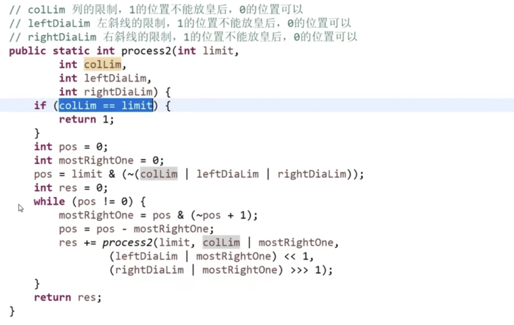

# DFS

图+DFS

200(岛屿问题) 46（全排列） 37（解数独）

## 暴力递归

分解成子问题，子问题交给黑盒去解决

保证黑盒以外的问题决策是合法的

（不需要考虑全局是怎么解决的）

### 汉诺塔问题

目的：打印全部移动过程

1. 1-i-1 from -> other

   `f(i-1. from, other)`

2. i from -> to

   `print "move i from ... to ..."`

3. 1-i-1 other->to

   `f(i-1, other, end)`

### 求所有子集

1. 复制列表
2. string的回溯（改回来）

### 全排列

利用swap：

res[i...]范围上所有的字符都可以换到i位置上，后续都去尝试

str[0...i-1]范围上是之前做的选择（已经换到前面了）

 分支限界（剪枝）

### 拿纸牌

**先手函数`f(arr,L,R)`**

base case: i==j: 剩一张先手直接拿

递归步：`max(arr[L] + s(arr, L+1,R), arr[R] + s(arr, L, R-1)`)

当前步收益+子问题收益

先手时当前步的结果是由自己决定的，贪心地选择收益更大的一个方案

**后手函数`s(arr,L,R)`**

base case: i==j: 只剩一张时后手，啥都拿不到，返回0

递归步：`min(f(arr, L+1,R), f(arr, L, R-1))`

当前步收益0+子问题收益

后手时，当前步的结果是由对手决定的，因此我的下一步是较劣的那一种方案。

### 逆序栈

只能用递归，不能申请额外的空间。

利用递归栈（在下层递归函数返回自己前）能够保存信息的性质

实现f：抽出栈底元素返回，剩下元素下沉

实现reverse：每次调用f记录返回值i（底层），递归调用下一层reverse，记录返回值i（次底层）...返回到本函数后再把i加入栈

### 数字对应的字符串转换

当前位置i + 子问题 f(i+1) + f(i+2) (如果可以两位一起的话)

*对于每一步，区分当前i位置字符的情况：*

1：可以i一位也可以[i:i+1]两位共同

2：如果i+1位置值<=6则可以两位共同

3-9：只可能自己对应一个字母

### 背包问题

## 回溯

不剪枝的回溯就是dfs，详见 [dsf与回溯](https://leetcode.cn/leetbook/read/dfs/nj8h1e/)

### 子集(Combination)和排序(Permutation)

子集(90)<->全排序(47)
区别：全排序要每一种顺序组合(permutation)，后面数可以小于前面，子集只要一种顺序(combination)，因此子集需要先排序，且后面数不能小于前面数（因此不用原地置换，直接从当前值val第一个出现位置开始搜索后面的就可以）

[90. 子集 II](https://leetcode.cn/problems/subsets-ii/) 

[47. 全排列 II](https://leetcode.cn/problems/permutations-ii/) 

## 例题

##### [623. 在二叉树中增加一行](https://leetcode.cn/problems/add-one-row-to-tree/)  

### n皇后问题

共斜线，*即斜率为1*：

`abs(列坐标相减) = abs(行坐标相减)`

时间复杂度：$O(n^2)$，常数时间可以优化

#### 优化

##### 利用位运算的特性代替record检查

任一格子放法，固定行，三种限制：

- 列限制
- 左对角线
- 右对角线

三种限制的位表示求或，再和limit（位数限制）求与，得到**可以放**的位置

（1的位置可以放，0的位置不能放）

`pos = limit & (~(colLim | leftDiaLim | rightDiaLim))`

>  `(colLim | leftDiaLim | rightDiaLim)`: 总限制，1表示不能放的位置
>
> `~`: 取反之后，放皇后的条件调反，1表示可以放的位置
>
> `limit &`: 位数限制，相当于把返回控制在了limit位范围，只保留limit位以内的1（表示limit范围内的合法位置）。

**如何遍历可以选的皇后？**

每次提取出最右侧的1: `pos & (~pos + 1)`

**如何表示下一行的限制（下一递归步状态）？**

列: `pos|colLim`，下一行--直接或运算

左对角线：`pos|leftDiaLim<<1`下一行--或运算左移一

右对角线：`pos|rightDiaLim>>1`下一行--或运算右移一

### 全排列

47（全排列II）39 77 78 （子集I）

## Reference

[总结回溯问题类型](https://leetcode.cn/problems/subsets/solution/c-zong-jie-liao-hui-su-wen-ti-lei-xing-dai-ni-gao-/)  

[8. 暴力递归](https://www.bilibili.com/video/BV1kQ4y1h7ok?p=9&vd_source=3ee85a74f53c722d5c1f8a852c0c7504) 

