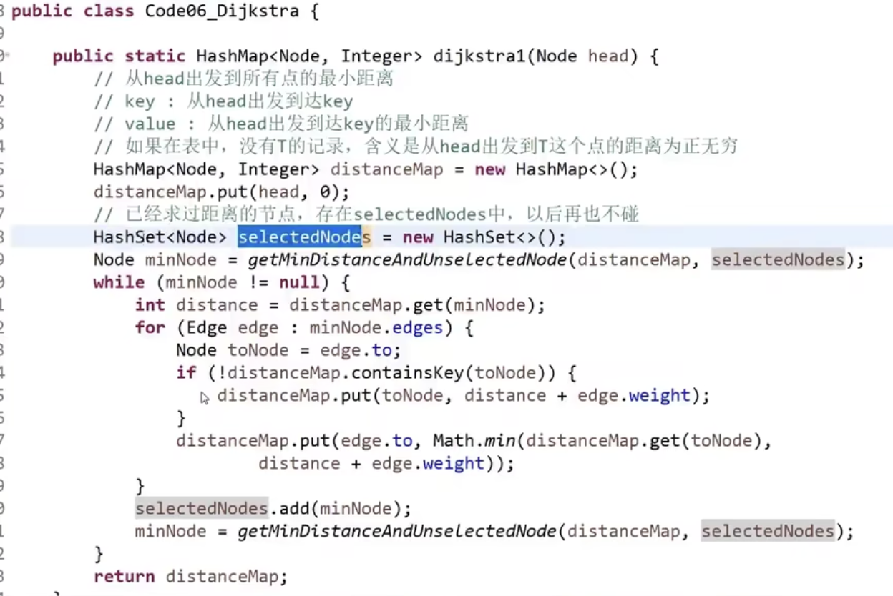
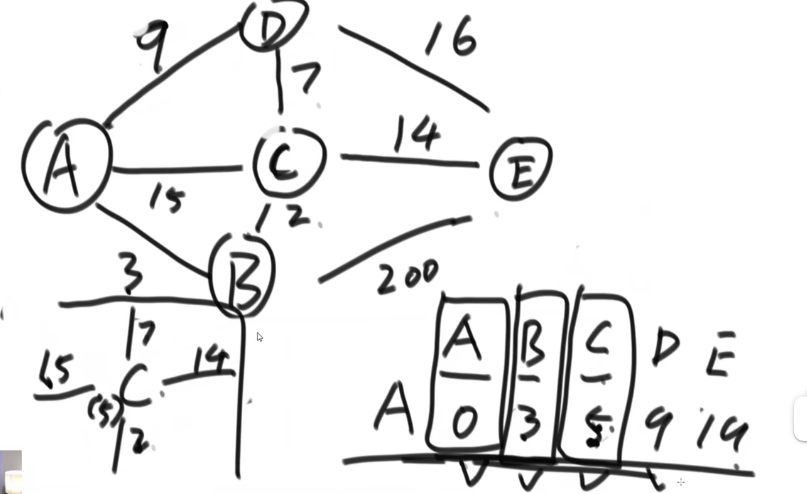

# 最短路径问题 (Dijksta's Algorithm)

适用范围：没有权值为负数的边

规定一个出发点，求出发点到所有点的最短路径距离。

思路：

从head出发，则经过当前点i的新方案距离为dis_i+w_ij，更新所有邻居的最小距离，锁定当前节点（visited）。

之后选择当前连通最小边未访问过的to节点，对于所有邻居更新新方案。

## 实现

 [zuoshen/Code_06_Dijkstra.java at master · Aaron-TangCode/zuoshen](https://github.com/Aaron-TangCode/zuoshen/blob/master/src/com/tanghainlin/basic_class_06/Code_06_Dijkstra.java) 

### 优化

#### 改写堆实现的方式优化Dijkstra

- 现在对于每个点，找下一个最小边是遍历的方式，代价比较高。
- 可以维护堆来实现对数级别的查最小值，但是Dijkstra算法会突然改写某一个节点距离（贪心步更新更小距离），等于堆中的改写单个值。
  - 系统实现堆不支持改写某一个值，改写一个值等于全局扫描，代价近似遍历。
  - 通过自己实现堆的方式，手动向上heapify可以把改写复杂度降到O(logN)

[实现](https://github.com/Aaron-TangCode/zuoshen/blob/master/src/com/tanghainlin/basic_class_06/Code_06_Dijkstra.java) 

**参考 **

- [详解前缀树和贪心算法 - 左程云算法](https://www.bilibili.com/video/BV1kQ4y1h7ok?p=8&vd_source=3ee85a74f53c722d5c1f8a852c0c7504) 