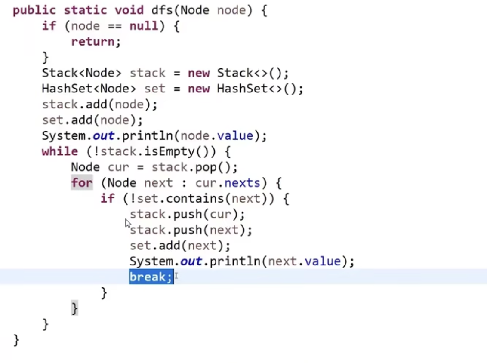

# 图

## 原理

### 无向图和有向图

入度：指向当前点的边

出度：从当前点出发的边

无向图每个点的的入度=出度

### 邻接表/邻接矩阵

两种结构各有优劣

- 邻接表可以直接查出一个节点的所有边

- 邻接矩阵可以查出有多少边

技巧：

自己实现一个熟悉的结构模板，遇到不同的表达图的数据结构只需要写数据方式之间的转换，然后调自己的结构

结构：graph、node、edge

### 遍历

#### BFS

队列

*需要维护 visited set*

#### DFS

用栈实现

*需要维护 visited set*一旦发现有没有走过的邻居，邻居和自己依次入栈，break。

### 拓扑排序

构建入度表、邻接表

BFS建图：

每次把入度为0的点弹出（维护zeroIn数组），然后更新当前指向的后序点的入度和zeroIn

详见[拓扑排序](topological_sort.md)。