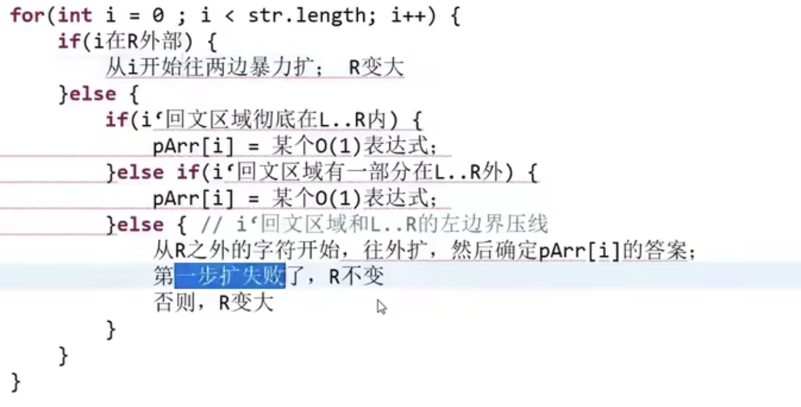

# Manacher

情况1：i在R外

情况2：i在R内

1. i对称i'的回文半径完整的在[L,R]之内

   i半径=i'半径

2. i对称i'的回文半径在[L,R]之外

   i半径=R-i

3. i对称i'的回文区域和[L,R]左边界压栈

   i半径至少是i'半径，再外侧要验

**参考：**

-  [Manacher算法 - 左程云算法课](https://www.bilibili.com/video/BV1kQ4y1h7ok?p=13&vd_source=3ee85a74f53c722d5c1f8a852c0c7504) 