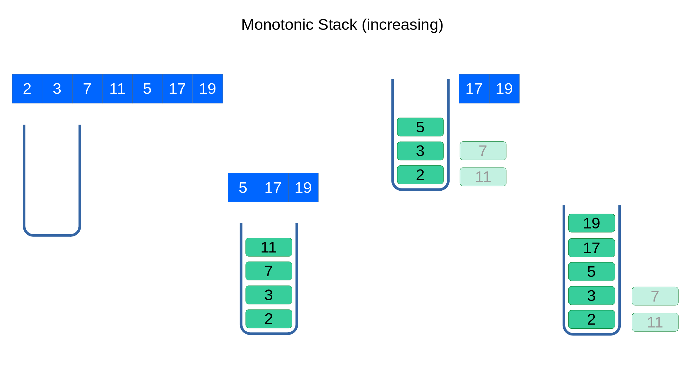

# 单调栈



**单调栈**是对于数组中的*范围查询*(range query)问题的最佳时间复杂度解决方案。 因为数组中的每个元素只入栈一次，所以时间复杂度是O(N)，N 表示数组的长度。

使用单调栈来维护范围可以节省大量时间。 单调堆栈可以维护范围内的最大/最小元素，同时保持范围内元素的顺序。 因此，我们不再需要一一比较元素来得到范围内的最大/最小值，避免了对现有元素的重复操作。 同时，由于它保留了元素顺序，我们只需要根据最新添加的元素更新堆栈。	

适合用单调栈解决的问题：

1. 数组中的**范围查询**问题
2. **单调性：**范围内元素的最小值/最大值元素，或元素的单调性顺序对于查询很有用。
3. **一次性使用：**每个元素只使用一次（出栈后不会再入栈）。

## 例题

 [239. 滑动窗口最大值](https://leetcode.cn/problems/sliding-window-maximum/) 

先入栈的先过期，后入栈的后过期。利用窗口结构的这种性质，如果后面的元素比栈里的大，则更小的就没用了。维护单调递减的栈，遍历时从栈里弹出所有小于等于当前值的元素，然后当前值入栈。

 [1856. 子数组最小乘积的最大值](https://leetcode.cn/problems/maximum-subarray-min-product/) 

>  考虑相等的边界情况：
>
> 单调栈>=或>时弹出都是正确的，这里是因为相等的数如果连成一片，那么这一片的结果都是一样的(eg)，这时候只要有一个的结果是正确的就行：
>
> eg:
>
> 1,2,2,2,2,4,2,1
>
> 2,2,2,2,2,1 这里中间的4位置只会是>2的数，不然就把他们分开了
>
> - 如果>弹出，则相等时只是加到队尾，等待更小值出现弹出这些相等值时，最后一个弹出的左边是更小值，右边是新的当前更小值，结果仍是正确的；
>
> - 如果>=弹出，则相等时用它替换所有相等的值，只保留最后一个（新添加的当前值），这个仅剩的值在遇到更小值弹出时，左边是更小值，右边是新的当前最小值，同样可以正确算出两边情况。
>
>   


 [768. 最多能完成排序的块 II](https://leetcode.cn/problems/max-chunks-to-make-sorted-ii/) 

上述分析过程中，我们只用到了块的最大值来进行比较，比较过程又是从右到左，符合栈的思想，因此可以用类似单调栈的数据结构来存储块的最大值。

 [84. 柱状图中最大的矩形](https://leetcode.cn/problems/largest-rectangle-in-histogram/) 

```python
class Solution:
    def largestRectangleArea(self, heights: List[int]) -> int:
        ret = 0
        mono_stack = [] #heights[i]单调递增
        heights.append(0)
        for i, v in enumerate(heights):
            while mono_stack and heights[mono_stack[-1]] > v:
                height = heights[mono_stack.pop()]
                # 对于每一个height, 求length即找到左右两侧最近的高度小于 height 的柱子
                # 左边界：d[-1]或0
                # 右边界：i-1
                if mono_stack: 
                  	#以height为高度的区间，d[-1]+1...i-1都是可以构成底的宽度
                    length = i-1 - mono_stack[-1] 
                else:
                  	#以height为高度的区间，前面都是比height高的（已经早被弹出了），0...i-1都是可以构成底的宽度
                    length = i #以height为高度的区间
                ret = max(ret, height * length)
            mono_stack.append(i)
        return ret
```

和84相似：

 [42. 接雨水](https://leetcode.cn/problems/trapping-rain-water/) 

相比#84需要额外比较左右两个边界柱子的高度，取较小值。

```python
# 单调栈：按层叠加
class Solution:
    def trap(self, height: List[int]) -> int:
        d = deque([]) #存储i，对应height[i]严格递减
        total = 0
        for i, h in enumerate(height):
            if not d or height[d[-1]] > h: #更小直接加
                d.append(i)
            else:
                while d and height[d[-1]] < h:
                    h0 = height[d.pop()] #base height
                    # 对于每一个h0,找最大的length即找最左和最右的端点（高度大于h0的柱子）
                    # 最左：d[-1]+1
                    # 最右：i-1
                    if d: #如果d为空说明左边没有承接的柱子了，不会增加，直接跳过
                        l = i-1 - d[-1]
                        h1 = min(height[d[-1]], height[i]) #取左右两条边中更短的
                        total += (h1 - h0) * l
                
                # 现在d中都比h[i]大
                d.append(i)
                
        return total
```

 [654. 最大二叉树](https://leetcode.cn/problems/maximum-binary-tree/) 

[image]

常规解法是dfs按顺序构造，时间复杂度是$O(N^2)$：N个node，每个node求max

因为和左、右节点位置和大小有关，这里可以采用单调栈解法，时间复杂度降低至$O(N)$。

```python
# 2. 单调栈
# Definition for a binary tree node.
# class TreeNode:
#     def __init__(self, val=0, left=None, right=None):
#         self.val = val
#         self.left = left
#         self.right = right
class Solution:
    def constructMaximumBinaryTree(self, nums: List[int]) -> Optional[TreeNode]:
        stack = deque([]) #单调递减
        for num in nums + [float('inf')]:
            if not stack or stack[-1].val > num:
                stack.append(TreeNode(num))
            else:
                prev = None #dummy占位
                while stack and stack[-1].val < num: #弹出所有前面比num小的值
                    cur = stack.pop()
                    cur.right = prev # prev即上一个弹出的值，prev是cur右边<cur的最大值，所有更小值已经被弹出了，根据定义cur.right = prev
                    prev = cur
                stack.append(TreeNode(num, left=prev)) # 所有<num的值都被弹出了，现在prev是num左边>num的最小值，根据定义num.left = prev

        return stack[0].left
```


 [654. 最大二叉树](https://leetcode.cn/problems/maximum-binary-tree/) 

## 参考

 [Algorithms for Interview 2: Monoztonic Stack | by Yang Zhou | TechToFreedom | Medium](https://medium.com/techtofreedom/algorithms-for-interview-2-monotonic-stack-462251689da8) 
