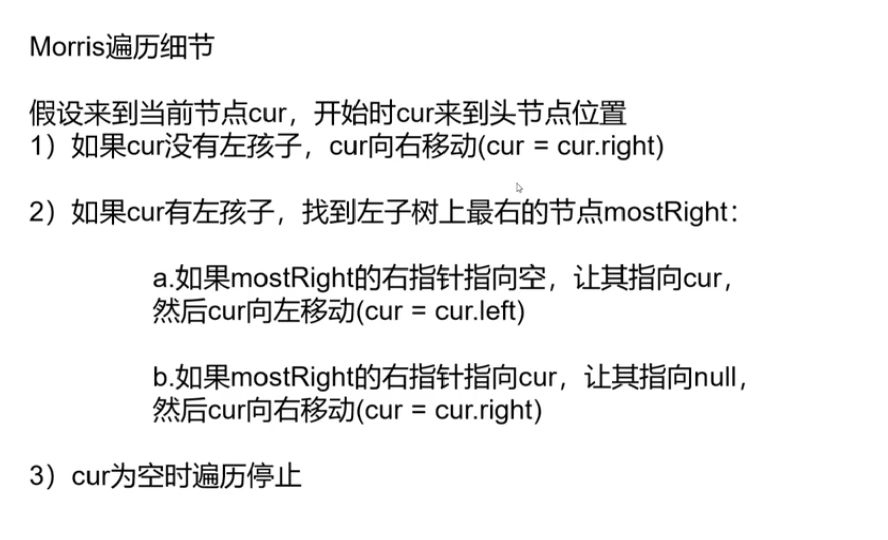
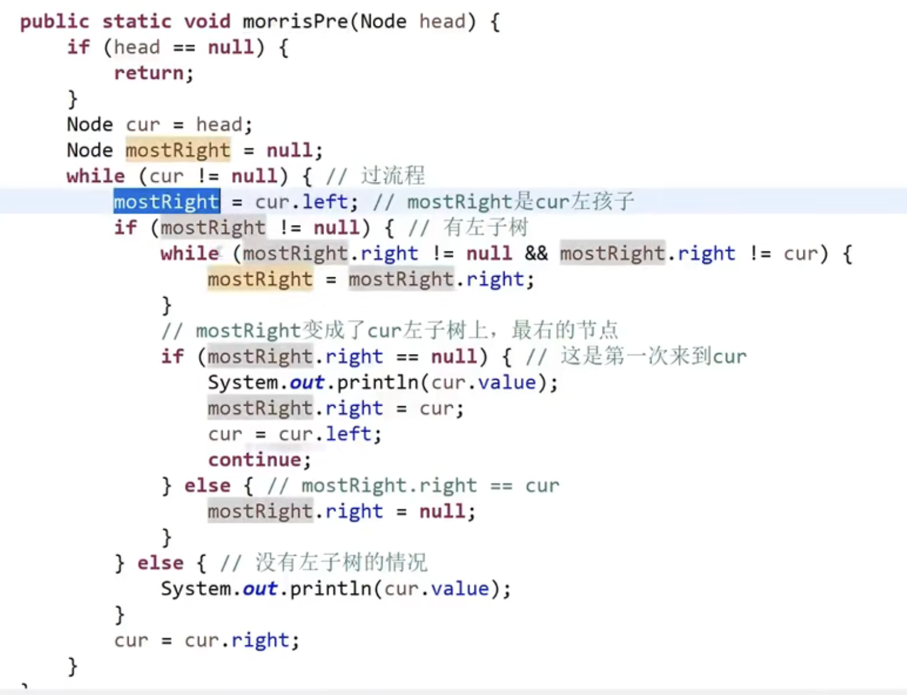

# 树形DP和Morris遍历

## 递归（树形DP）  

左树需要什么信息

右树需要什么信息

（如果需要的不同，全部都返回：参考判断BST）

如何加工为自己子树的信息

 [124. 二叉树中的最大路径和](https://leetcode.cn/problems/binary-tree-maximum-path-sum/) 


## Morris遍历

一种遍历二叉树的方式，并且时间复杂度O(N)，额外空间复杂度O(1)

通过利用原树种大量空闲指针的方式，达到节省空间的目的。

 [zuoshen/Code_01_MorrisTraversal.java at master · Aaron-TangCode/zuoshen](https://github.com/Aaron-TangCode/zuoshen/blob/master/src/com/tanghainlin/advanced_class_03/Code_01_MorrisTraversal.java) 



## Morris遍历实现

```python
public static void morrisIn(Node head) {
		if (head == null) {
			return;
		}
		Node cur1 = head;
		Node cur2 = null;
		while (cur1 != null) {
			cur2 = cur1.left;
			if (cur2 != null) {
				while (cur2.right != null && cur2.right != cur1) {
					cur2 = cur2.right;
				}
				if (cur2.right == null) {
					cur2.right = cur1;
					cur1 = cur1.left;
					continue;
				} else {
					cur2.right = null;
				}
			}
			System.out.print(cur1.value + " ");
			cur1 = cur1.right;
		}
		System.out.println();
	}
```

## 先序、中序和后序

#### **用Morris 先序遍历**

只到访一次，直接打印；

访问二次的节点，**第一次**到打印   



#### 用Morris**中序遍历 **

只到访一次，直接打印；

访问二次的节点， **第二次**回到打印


#### 用Morris后序遍历

逆序打印左树的右边界

然后单独逆序打印整棵树右边界

## 判断二叉树的最优解法

如果必须做第三次汇总信息的强整合（需要汇总并整合所有子树的信息）：一个节点需要要完左子树信息和右子树信息后做汇总整合，则最优解是**树形dp（递归）**。

eg: 最长路径、公司的快乐值

 如果不需要做所有子树的强整合（遍历、依次判断...），则最优解是**Morris遍历**。

eg: 前中后序遍历、判断BST（中序遍历）

## 例题

#### 判断BST

Morris输出中序遍历只会在出if条件后（无左子树时）打印（见上面代码）。因为只有这一个打印出口，所以维护一个preVal记录上一个值，只需要每次打印时和上一个值比较：如果<=preVal则违反了中序递增的顺序，直接返回False。否则遍历结束后返回True即可。


