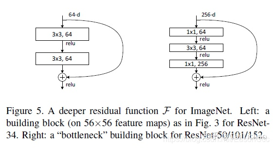
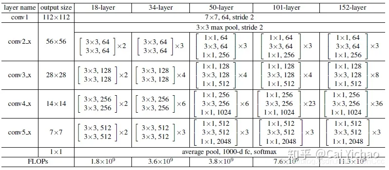

## Residual Networks

before ResNet: up to 20 layers

after: thousands of layers possible

**intuition**: 56-layer network should perform (in training error) at least  as good as 20-layer, because the rest 36 layers could learn to do nothing.

**idea**: make it easy to learn to do nothing 

- forward: F(·) can learn to output 0, many ways to do that. but without residual F(x) has only one way to propagate identity(hard to learn that as example above)

- backwards: gradients split at plus gate, so even F(x) mess up with the gradient (eg: vanishes), x is still able to propagate the gradient back

**note:** can only do resnet if input and output dimensions of residual block are same-size

### Reversible Residual Network

computational trick to save memory(trade time for space)

## ResNet

 [PyTorch实现ResNet亲身实践 - 知乎](https://zhuanlan.zhihu.com/p/263526658) 

### Basic and Bottleneck Blocks

两种基础building block：

结构都是在卷积层后面，添加一跳short cut，将输入与卷积层组的输出相加。

basic block: 两个卷积层，都是3*3的kernel，kernel数量相同

bottleneck block: 三个卷积层，kernel为1\*1, 3\*3, 1\*1，前两层kernel数量相同，第三层kernel数量是前两层的4倍。

### BN

原文中提出，在每个卷积层后面，ReLU激活单元前面，使用BN操作。

### 网络结构

**基于源码的观察：**

- 在经过每组卷积层组之后，尺寸降低了一半。
  - 实现：conv2_x第一层是一个stride=2的max pooling，后接residual block里stride=1；其他conv3_x到conv5_x没有max pooling层，但第一个block中的第二层stride=2。
- residual connection需要保证进block前后的feature map尺寸相同
  - 实现：所有3*3的卷积层都使用same padding(等同于padding=1)
  - shortcut的部分如果stride>1则要过一个1\*1的卷积层，保证和深度网络分支的尺寸同步，才保证可以拼接。

