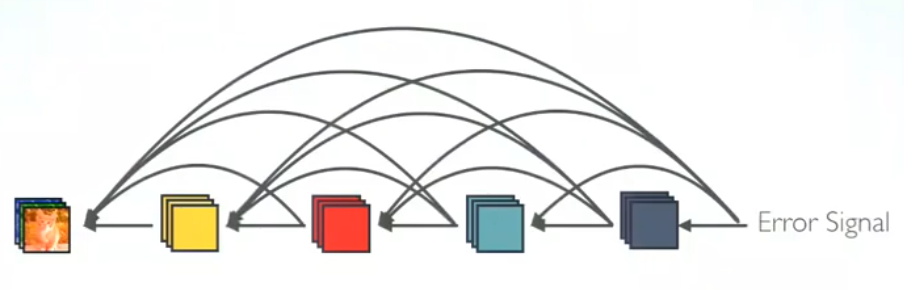
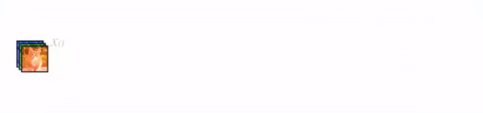
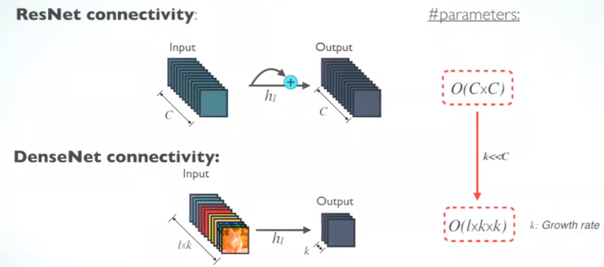
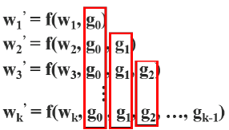

# DenseNet

[DenseNet paper](https://arxiv.org/pdf/1608.06993.pdf) 

[DenseNets - YouTube](https://www.youtube.com/watch?v=_8zx4T1Wcmg)  

[2016 DenseNet paper summary - YouTube](https://www.youtube.com/watch?v=hSC_0S8Zf9s) 

>  In **DenseNet**, each layer obtains additional inputs from all preceding layers and passes on its own feature-maps to all subsequent layers. **Concatenation** is used. **Each layer is receiving a “collective knowledge” from all preceding layers**.

## architecture

### connectivity patterns

- each layer receives feature maps from all preceding layers

  - network can be thinner and compact, i.e. number of channels can be fewer.

  - The growth rate *k* is the additional number of channels for each layer.

  '

### trainsition layer

- concatenation operation is not viable when the size of feature-maps changes.
  - need down-sampling layer to change feature map sizes
- *transition layers* divide the network into multiple densely connected dense blocks

- controlling depth with 1*1 convolution and pooling
  - 1*1 convolution:  [A Gentle Introduction to 1x1 Convolutions to Manage Model Complexity](https://machinelearningmastery.com/introduction-to-1x1-convolutions-to-reduce-the-complexity-of-convolutional-neural-networks/)  
    -  preserves spatial dimensions but shrinks the depth of feature maps.(channel-wise pooling)
    - **act like a single neuron** with an input from the same position across each of the feature maps in the input.

### pros and cons

**advantages:**

- strong gradient flow

- Parameter & Computational Efficiency

  - ResNet layer: $O(C \cross C)$

  - DenseNet layer: $O(l \cross k \cross k)$

  - $k<<c$ , DenseNet has much smaller size than ResNet.

    

- more diversed features

**problem:** duplicate gradient information

- DenseNet concatenate input and output of layer i as input of layer i+1

  

- during BP, lots of gradients information are reused

  

### 