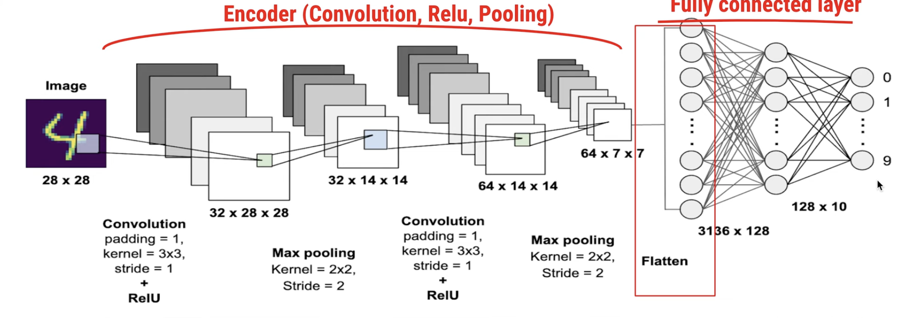
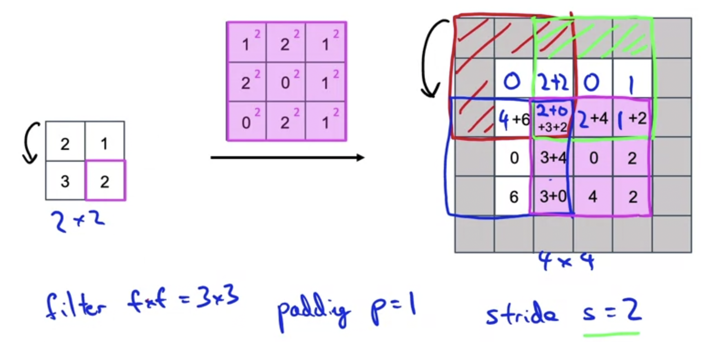

# FCN 

 [2014 Fully Convolutional Network (FCN) Paper summary - YouTube](https://www.youtube.com/watch?v=Ahge3GzQ3Kg&t=570s) 

 [paper](https://arxiv.org/abs/1411.4038) 

用于 pixel-wise semantic segmentation

优势

- can take arbitrary size as input 可以接受任意输入尺寸
- up sampling: 还原输入的维度
- skip connection: combine different semantic information

architecture

pixel-wise semantic segmentation

## conventional CNN

encoder + fully connected layer

as encoder gets deeper: input size smaller, number of feature maps/kernels gets larger

从local到global：

越全局、high-level的特征越需要更多个的kernel才能捕捉？

## FCN Architecture

### Convolutionization

Operates on an input of any size, and produces and output of corresponding spatial dimensions.

- encoder结束后不接flatten layer，改为$1*1*d_{out}$的conv layer
  - n_channel = $d_{out}$
  - 不需要指定flatten layer的维度（神经元个数），因此对输入没有严格的维度限制
- 使用interpolation"放大"尺寸，恢复原来的image size  
  - 对于segmentation类任务，需要输出per-pixel的结果（输出尺寸=输入尺寸）

### Deconvolution

#### deconvolution

mathematical process to reverse convolution

#### [transposed convolution](https://www.coursera.org/learn/convolutional-neural-networks/lecture/kyoqR/transpose-convolutions)

### 

- instead of place filter on the input, "place" filter on the output matrix

steps:

- duplicate value of the **single** input entry on **every** entry of filter
- "paste" on output entry(fix the result position) -- note: not final value, probably need to add values later
- continue with stride and paddings
- sum up value for each output entry 

### upsampling(interpolation) + convolution

interpolation with nn-interpolation/linear interpolation, then convolve

**alternative** to deconvolution: helps avoid **[Checkerboard Artifacts](https://distill.pub/2016/deconv-checkerboard/)** 

### Skip connection

- combine **coarse, global** information + **fine-grained, local** information
  - make local predictions that respect global structure
- ==as they see fewer pixels,== the finer scale predictions should need fewer layers, so it makes sense to make them from shallower net output？ 

## result

