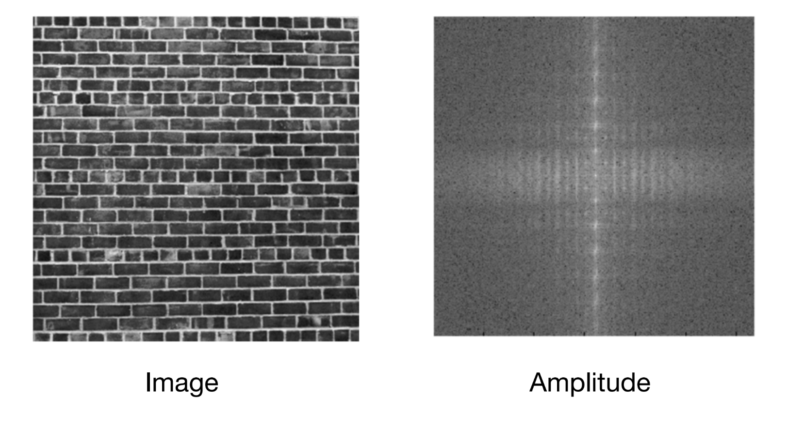
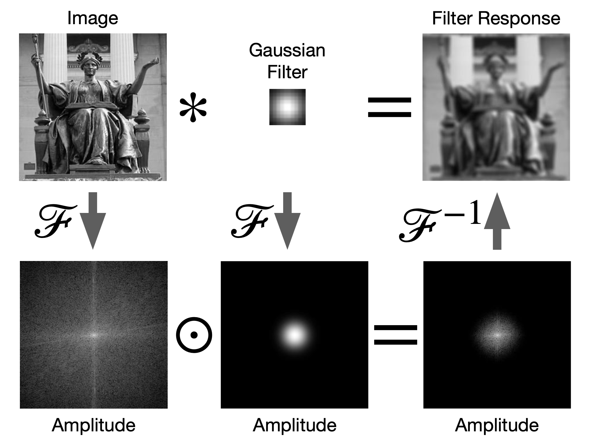
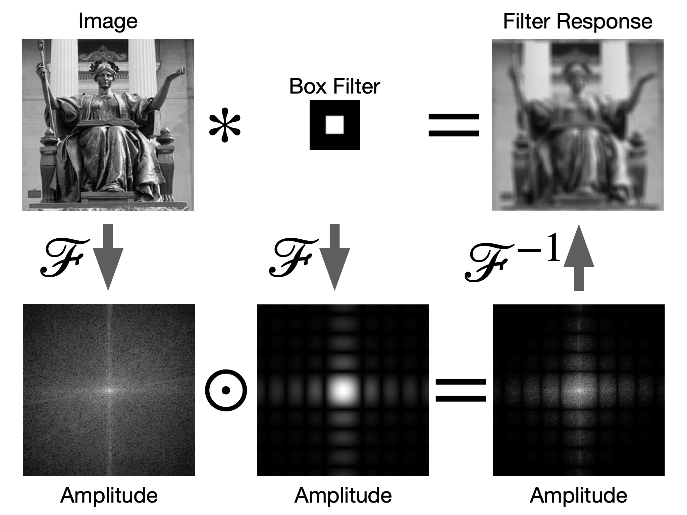

# Fourier Transform

 [02 Convolution.pdf](../../W4732 CV II/Slides/02 Convolution.pdf) 

## Sinusoids

$A -amplitude$ 
$\phi - phase$ 
$f - frequency$

$$
f(t) = A \sin(2\pi ft + \phi) = A \sin(\omega x+\phi)
$$

## Joseph Fourier's Theroem

**A bold idea(1807)**: Any univariate function can be rewritten as a weighted sum of sines and cosines of different frequencies.

### 1D Fourier Transform

(ignore the x labels)

map frequency(x) -> amplitude, phase(y)

center is 0

### 2D Fourier Transform

**振幅 amplitude**: center is (0,0). black is 0, white $\infin$.==频域？==

**相位phase**: center is (0,0). grey is 0, white $\infin$, black $-\infin$.

- most information is stored in the phase
- amplitude is usually similar
  - reason: most natural photo is smooth, pixels is not changing much

## The Fourier Transform

$$
G(f) = \int_{-\infin}^{\infin} g(t) e^{-2\pi ift} dt
$$

> $t$ - location in image(signal)
>
> $g(t)$ - function of image(signal)

> **How I think of it:**
> You wrap g(t) around the circle with frequency $f$, then calculate average position of $g(t)$

### Square Waves

> **Fourier Transform** is essentially converting the original signal $g(t)$ into a new domain by frequency; for every frequency you are getting a complex number $G(f)$ back, from which you can extract things like amplitude and phase.

$G(f)$:  for a wave out of particular frequency, tells what the amplitude and phase should be 

**amplitude**: magnitude of  $G(f)$
$$
\sqrt{\mathfrak{R}[G(f)]^2 +  \mathfrak{I}[G(f)]^2}
$$
**phase**: angle of $G(f)$
$$
\tan ^{-1} \frac{\mathfrak{I}[G(f)]}{\mathfrak{R}[G(f)]}
$$
**Inverse Fourier Transform**

going back, is almost the same:
$$
g(t) = \int_{-\infin}^{\infin} G(f) e^{2\pi ift} df
$$

### Examples

#### Artificial Waves

#### Repeated Patterns

FT has peaks at spatial frequencies of repeated structure

### Image Compresison

#### Removing high frequencies

image compression: only stores low-frequency information

> eg: jpeg

*this correspond to convolution with a big averaging filter.

#### Edge Detection

## Convolution

Convolution in time space is multiplication in frequency space:
$$
g(x) * h(x) == \mathscr{F}^{-1}\Big[\mathscr{F} [g(x)] \cdot \mathscr{F} [h(x)]\Big]
$$

Convolution in frequency space is multiplication in time space:
$$
\mathscr{F} [g(x)] * \mathscr{F} [h(x)] == \mathscr{F}\Big[ g(x) \cdot h(x) \Big]
$$

### Computation Efficiency

convolution vs FT:

- depends on how fast FT operations are

- if filter is huge, FT is faster.

### Gaussian Filter

> **FT of Gaussian is Gaussian**
>
> $G(f) \sim Gaussian(0, \sigma')$
>
> - mean is the same(0), variance is different
>
> 

### vs Box Filter

**FT of box filter:**

# 

### Laplacian Filter

removes extremely low and extremely high frequency bits

# Hybrid Images

- red line - 150m away
- human eye cannot see waves above the redline
- can use this to hide things behind the grey

> example:
>
> low ref Marilyn Monroe + high ref Einstein:
>
> as walking far away, one can only see low ref (Monroe) images.
>
> 
>
> http://cvcl.mit.edu/hybrid_gallery/gallery.html 

