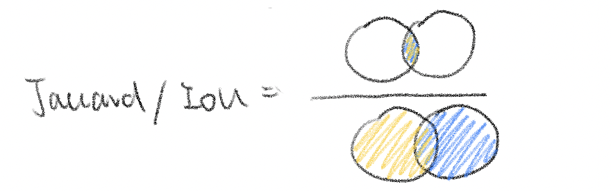
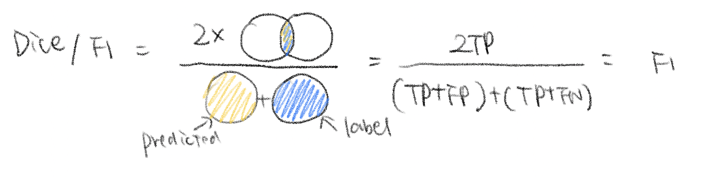
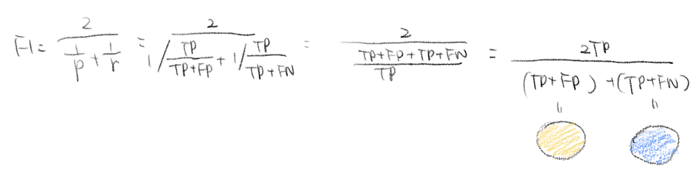

# Object Recognition

 [Convolutional Neural Networks - Object Detection | Coursera](https://www.coursera.org/learn/convolutional-neural-networks/home/week/3) 

## Context

[Sapir–Whorf hypothesis](https://en.wikipedia.org/wiki/Linguistic_relativity)

- people's perceptions are relative to their spoken language

## Region Proposals

tries to pick just a few regions that makes sense to run your continent crossfire.

segmentation algorithm: find ~2000 blobs of potention interests

**R-CNN:**

Propose regions. classify proposed regions **one at a time**. output label + bounding box

**Fast R-CNN:**

Propose regions. use **convolution implementation** of sliding windows to classify all the proposed regions.

(roughly similar to convolution implementation)

**Faster R-CNN:**

starting point: clustering step in Fast R-CNN to propose the regions are relatively slow

use **convolutional network** to propose regions.

*Faster R-CNN usually still quite slower than YOLO*

> Andrew's notes on region proposal:
>
> I think that region proposal is an interesting idea by that not having two steps-- first propose region and then classify it--being able to do everything all at the same time, similar to the YOLO or the You Only Look Once algorithm that seems to me like a more promising direction for the long term. 

### R-CNN

two stage pipeline: first classify where the interesting image regions are, then do a classification of each region

### Fast R-CNN and Faster R-CNN

allow do both stage jointly, first propose candidate window, then classify them, so train this end-to-end s.t. gradients can be propagated back through all. if you learn to propose windows, if would then be useful for classification. 

#### Fast R-CNN

subsample the windows

Conv feature map: spatiallly, **"where"** the windows are 

ROI feature vector: encoded content, **"what"**  to propagate through

**softmax:** score - should you continue processing it

**regressor:** what is this, why is that out there 

#### Faster R-CNN

output a score(trainable) for every single window, pick top 300

**region proposal network**: 

propose region-cropping which is differentiable

**RoI Pooling:** max-pooling, combining where+what -  reszing the feature vector so that each vector is of same size, to feed into classification network

## Detection, Segmentation

### detection

bounding box

### segmentation

#### semantic segmentation

object categories: bird vs sky

#### instance segmentation

per instance

### Fully Convolutional Networks

raw image(pixels) as input, output image encoding what all the categories are

everything is a convolution

no resizing

if you keep doing convolution you will get another image out

### U-Net

**idea:** tradeoff between

- do want to integrate some global information (down-sampling)
  - if you never resize, hard to get long-range (cross-pixels) connections eg: pixel of a bed

- also want to include enough information and details

**encoder**: downsample

more and more global information

**decoder**: upsample

increase resolution

**skip connections**: avoid bottleneck, propagate to same-resolution layers

# Deeplearning.ai

## localization vs detection

### Classification with Localization

single-instance

### detection

multi-instance

## Classification with Localization

image -> ConvNet -> vector feature(n classes) -> softmax(n classes)

## Sliding windows detection algorithm

### Convolutional Implementation(FCN)

## Metrics for Object Detection 

# Object Segmentation

## Metrics for Object Segmentation

Jaccard/IoU

Dice/f1

 [terminology - F1/Dice-Score vs IoU - Cross Validated](https://stats.stackexchange.com/questions/273537/f1-dice-score-vs-iou/276144#276144)  

IoU vs Dice:

- similar performance, *always* positively correlated

- IOU penalize single instances of bad classification more (squaring effect to errors similar to L2 more than L1

  ⇒ F tends to measure close to average performance IOU tends to measure close to worst case performance 

- for both: TP低的时候表现不佳

eg:

>  GT 1 pixels
>
> pred 2 pixels, include GT
>
> then:
>
> IoU = 1/2
>
> F1 = 2/3
