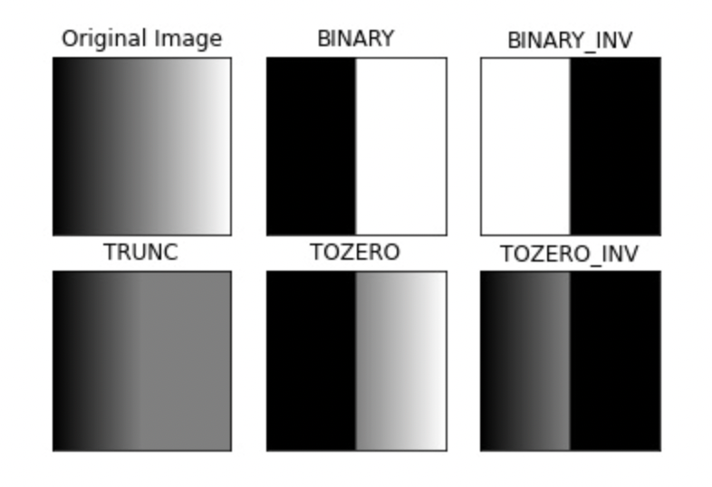
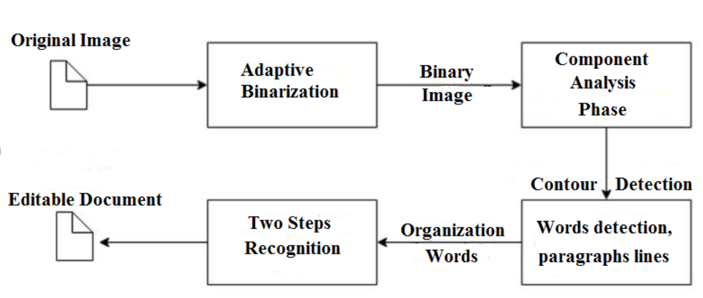
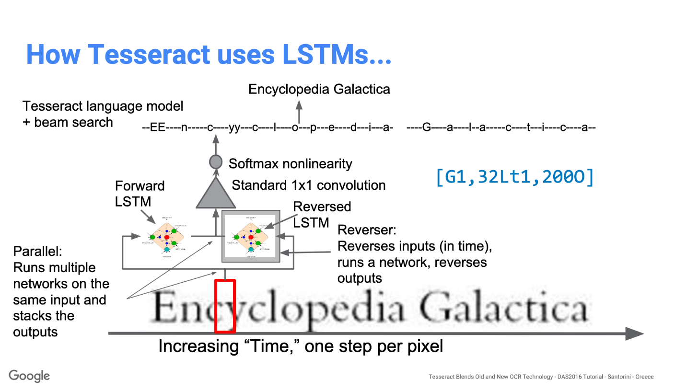

# OCR

## OCR, in general

OCR = Optical Character Recognition 光学文字识别

含文字的图像 --> （格式化）文字

### Popular OCR Models

- conventional online OCR systems like  [zonal OCR](https://nanonets.com/blog/zonal-ocr/): limited fonts, formats
  - eg: proportionally spaced type (not monospaced)

- EasyOCR(lightweight but mostly for pdf conversion)
- Tesseract(for image conversion): 
  - Tesseract 4.x: Tesseract engine + LSTM-based(from OCRopus)
  - good performance in **high-resolution images.**
- OCRopus(based on LSTM, less used nowadays)
  - **A collection of document analysis programs, not a turn-key OCR system.** 
  - To apply it to your documents, you may need to do some **image preprocessing**, and possibly also **train new models**.
- Ocular: works best on documents printed using a hand press, state of the art historical OCR tool
- [SwiftOCR](https://github.com/garnele007/SwiftOCR): writtin in swift, claims to outperform Tesseract

### Evaluation

#### CER: character-level

+ $CER = (S+D+I)/N$
  + where:
  + S = Number of Substitutions
  + D = Number of Deletions
  + I = Number of Insertions
  + N = Number of characters in reference text (aka ground truth)

- evaluation:

  + Good OCR accuracy: CER 1‐2% (i.e. 98–99% accurate)
  + Average OCR accuracy: CER 2-10%
  + Poor OCR accuracy: CER >10% (i.e. below 90% accurate)

#### WER: word-level

- $WER = (S_w+D_w+I_w)/N_w$
  + A WER of 5-10% is considered to be good quality and is ready to use.

## ==Preprocessing==

 [Borderless Tables Detection with Deep Learning and OpenCV | by Volodymyr Holomb | Towards Data Science](https://towardsdatascience.com/borderless-tables-detection-with-deep-learning-and-opencv-ebf568580fe2) 

 [Improving the quality of the output | tessdoc](https://tesseract-ocr.github.io/tessdoc/ImproveQuality) 

### OCR Preprocessing overall

**Problems for prediction:**

- headers with darker background colors are
  hard to recognize
- recognizing the whole table is harder than
  recognizing each cell

**Solution:**

- background removal
- reconstruct table structure, then separate
  each cell
- implemented using OpenCV

### thresholding

 [OpenCV: Image Thresholding](https://docs.opencv.org/4.x/d7/d4d/tutorial_py_thresholding.html) 


- [cv.THRESH_BINARY](https://docs.opencv.org/4.x/d7/d1b/group__imgproc__misc.html#ggaa9e58d2860d4afa658ef70a9b1115576a147222a96556ebc1d948b372bcd7ac59)
- [cv.THRESH_BINARY_INV](https://docs.opencv.org/4.x/d7/d1b/group__imgproc__misc.html#ggaa9e58d2860d4afa658ef70a9b1115576a19120b1a11d8067576cc24f4d2f03754)
- [cv.THRESH_TRUNC](https://docs.opencv.org/4.x/d7/d1b/group__imgproc__misc.html#ggaa9e58d2860d4afa658ef70a9b1115576ac7e89a5e95490116e7d2082b3096b2b8)
- [cv.THRESH_TOZERO](https://docs.opencv.org/4.x/d7/d1b/group__imgproc__misc.html#ggaa9e58d2860d4afa658ef70a9b1115576a0e50a338a4b711a8c48f06a6b105dd98)
- [cv.THRESH_TOZERO_INV](https://docs.opencv.org/4.x/d7/d1b/group__imgproc__misc.html#ggaa9e58d2860d4afa658ef70a9b1115576a47518a30aae90d799035bdcf0bb39a50)

```python
import cv2 as cv
import numpy as np
from matplotlib import pyplot as plt
img = cv.imread('gradient.png',0)
ret,thresh1 = cv.threshold(img,127,255,cv.THRESH_BINARY)
ret,thresh2 = cv.threshold(img,127,255,cv.THRESH_BINARY_INV)
ret,thresh3 = cv.threshold(img,127,255,cv.THRESH_TRUNC)
ret,thresh4 = cv.threshold(img,127,255,cv.THRESH_TOZERO)
ret,thresh5 = cv.threshold(img,127,255,cv.THRESH_TOZERO_INV)
titles = ['Original Image','BINARY','BINARY_INV','TRUNC','TOZERO','TOZERO_INV']
images = [img, thresh1, thresh2, thresh3, thresh4, thresh5]
for i in range(6):
    plt.subplot(2,3,i+1),plt.imshow(images[i],'gray',vmin=0,vmax=255)
    plt.title(titles[i])
    plt.xticks([]),plt.yticks([])
plt.show()
```



#### Adaptive Thresholding

The **adaptiveMethod** decides how the threshold value is calculated:

- [cv.ADAPTIVE_THRESH_MEAN_C](https://docs.opencv.org/4.x/d7/d1b/group__imgproc__misc.html#ggaa42a3e6ef26247da787bf34030ed772cad0c5199ae8637a6b195062fea4789fa9): The threshold value is the mean of the neighbourhood area minus the constant **C**.
- [cv.ADAPTIVE_THRESH_GAUSSIAN_C](https://docs.opencv.org/4.x/d7/d1b/group__imgproc__misc.html#ggaa42a3e6ef26247da787bf34030ed772caf262a01e7a3f112bbab4e8d8e28182dd): The threshold value is a gaussian-weighted sum of the neighbourhood values minus the constant **C**.

```python
ret,th1 = cv.threshold(img,127,255,cv.THRESH_BINARY)
th2 = cv.adaptiveThreshold(img,255,cv.ADAPTIVE_THRESH_MEAN_C,\
            cv.THRESH_BINARY,11,2)
th3 = cv.adaptiveThreshold(img,255,cv.ADAPTIVE_THRESH_GAUSSIAN_C,\
            cv.THRESH_BINARY,11,2)
```


### structure recognizing

 [OpenCV: Morphological Transformations](https://docs.opencv.org/4.x/d9/d61/tutorial_py_morphological_ops.html) 

#### border enhancing(prep)

**思路：**生成一个辅助border recogniton的图像--整行/列的空白填黑，深色的数字变浅。

**识别空白行/列：**维护dict计数器数每个值的像素数量

1. 遍历所有列，记下空白的列 

   - 遍历完行之后把空白列和其前一列涂黑
   - （不干扰到行的识别）

2. 遍历所有行，空白行涂黑

   2.1 对于不完整的行（比如同一格里面分出的子结构，短的行），如果一行中有一段固定长度的都是黑的，把整行和前一行都涂黑

   2.2 把空白行涂黑

   2.3 深色数字变浅

#### structure/border recoginiton

方法：

- **erode（腐蚀） + dilate（扩散）：提取出行和列**
  - 对于行和列，定义相应的kernel
  - erode去除白噪音，dilate放大kernel对应的特点
- **bitwiseand: **行、列交叉的位置就是每个表格单元的顶点
- 对交叉点排序，遍历x和y交叉点筛选顶点：
  - 当前位置 - 前一个位置 > thresh_stripe则为顶点，记录顶点位置


## Tesseract OCR

 [Tesseract OCR in Python with Pytesseract & OpenCV](https://nanonets.com/blog/ocr-with-tesseract/#:~:text=Tesseract%20is%20an%20open%20source,under%20the%20Apache%202.0%20license.)  

[What is Tesseract and how it works? | by BytePace | Medium](https://bytepace.medium.com/what-is-tesseract-and-how-it-works-dfff720f4a32) 


- 文字识别 + 保留格式
- 对preprocessing要求高
  - low-frequency changes in brightness must be [high-pass filtered](https://en.wikipedia.org/wiki/High-pass_filter)
  - remove dark borders

### Architecture

#### legacy tesseract engine:



- polygonal approximation
- contour detection
- **two-step approach that calls adaptive recognition**
  - one stage for character recognition
  - second stage to match word/context

#### LSTMs

 How Tesseract uses LSTM model [presentation](https://github.com/tesseract-ocr/docs/blob/main/das_tutorial2016/6ModernizationEfforts.pdf) 

- LSTM code based on OCROpus Python implementation.
- Fully integrated with Tesseract at the group-of-similar-words level.

