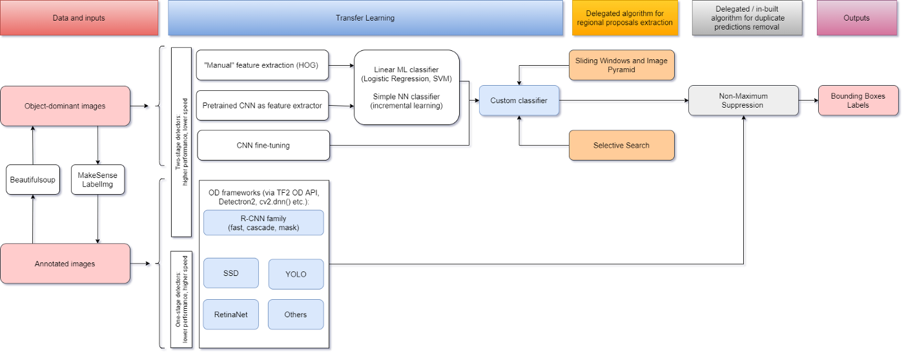
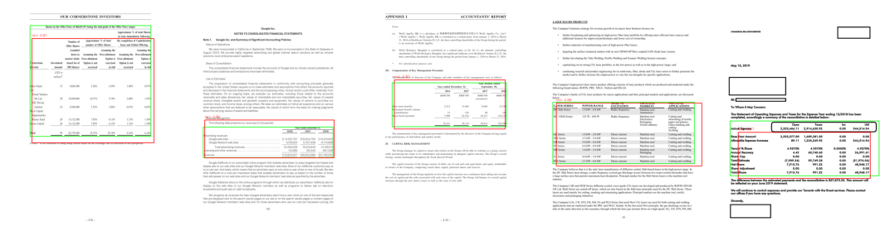
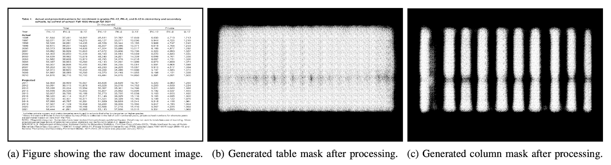
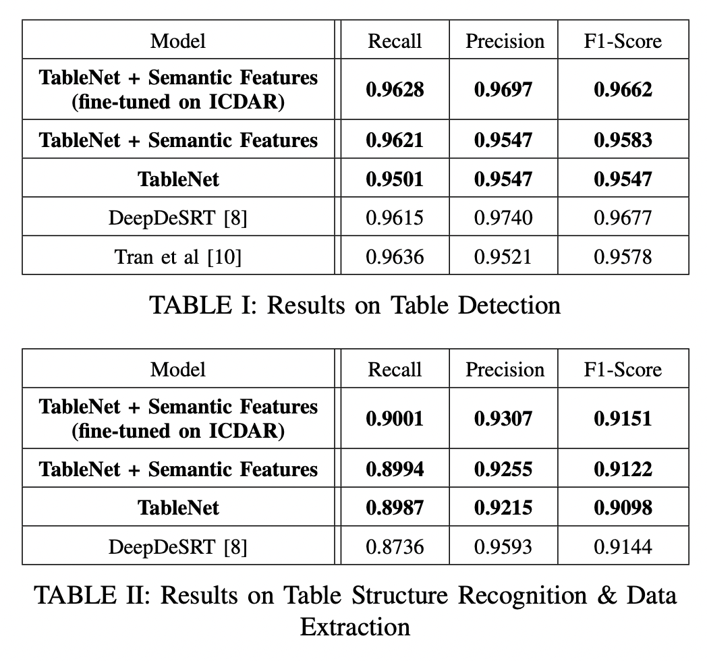

# Table Recognition

[report](https://github.com/ybliu9/EyeGazeCapstone/blob/main/reports/TableExtraction-FinalReport.pdf)

## Table Recognition, in general

## 

- two-stage recogniton

  - sliding windows and image pyramid
  - selective search

- single-shot recogniton

  - backbone: base network, pretrained 

## Table Detection with YOLO

task: table detection (bounding box)

### evaluation

Intersection over Union (IoU): overlap / union

-  $IoU > 0.5$  - "good prediction"

### cell recognition

reconize the cell with OpenCV

### result

test mAP 0.824

### time

1001.62s / 300 epoches, RTX2070

## TableNet

######  [paper](https://arxiv.org/pdf/2001.01469.pdf)  [github repo](https://github.com/jyjuni/TableNet_Tesseract_OCR/) 

two subtasks for table recognition 

1) table detection (bounding box)
2) **table structure recognition**

### Architecture

**[code](https://github.com/jyjuni/TableNet_Tesseract_OCR/blob/main/script/network.py)** 

**most algorithms** - solves two tasks independently using two seperate models

**TableNet** - solves twin tasks end-to-end together 

> exploit the interdependency of two tasks, column filter and table filter could reinforce each other

#### **1. share encoder, seperate decoders：**

- **single** encoder: base network with VGG-19
  - VGGNet: 
    - Deep is good, simple architecture with repetitive **3x3 convolutions and 2x2 pooling**
    - pretrained on ImageNet
  - additional spatial semantic features(semantic info of header colorcoded)

- **two** decoder branches:
  1. segmentation of the **table** region
  2. segmentation of **columns** within a table region

- rule-based row extraction --> cell + structures

#### **2. FCN**

- Table Recognition has smaller tolerance for noise than generic recognition task
- use **pixel-wise prediction** with FCN
  - convolutionization: replace FCs in VGG with 1*1 conv layers
    - any input size
    - easier to restore size with interpolation
  - upsampling(interpolation)
    - pixel-wise
  - skip-pooling(skip connection between poolings)
    - combine fine-grained, local features + coarse, global features

### training

**input**: one image, any size (with GT bitmaps)

**output**: two different sementically labelled output images (table + column)

### data

- ICDAR-2013
  - benchmark for table recognition

- Marmot dataset(annotated)

- FinTabNet(我们的数据)

### result

[复现](https://github.com/jyjuni/TableNet_Tesseract_OCR/blob/main/TableNet.ipynb) 

### time

1001.62s / 10 epoches, RTX2070

