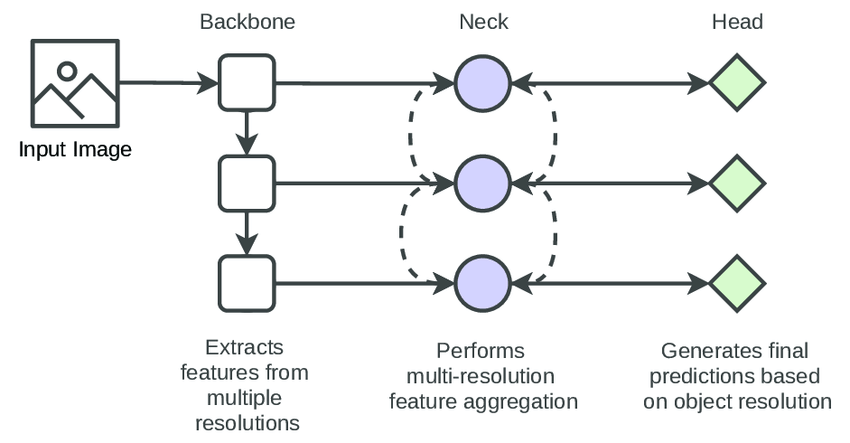
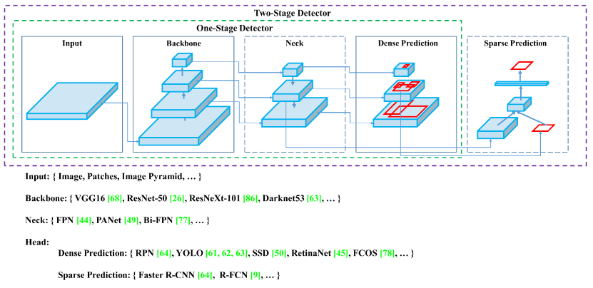
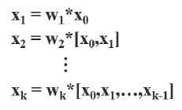
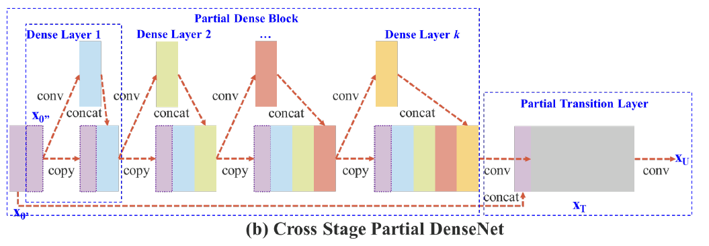
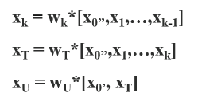
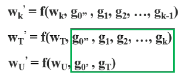
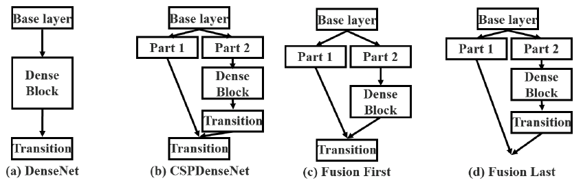
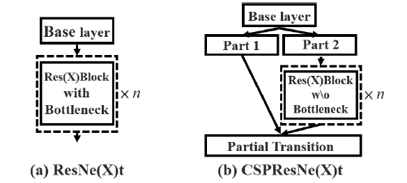

# YOLO algorithm

> "YOLO may not be the best detector, but it is the most colorful one."


### single-shot vs two-shot:

**end-to-end**/single-shot detector: both detection and classification

looking for specific bounding boxes

vs two-shot/two-stage: first draw bounding box, then classify it


**yolo's contribution**: 

all focus on speed 

single-shot detector

- like object localization task (vs sliding window):
  - output bounding boxes of any aspect ratio
  - output more precise coordinates that aren't just dictated by the stripe size of the sliding window classifier

- **convolutional implementation:** choose the conv layers and the max pool layers so that this eventually maps to a 3 by 3 by 8 output volume.
  - can extract information $p_c$, bounding box coordinates $b_x, b_y, b_h, b_w$ and class labels $c_1,c_2,c_3$ from each $\mathbf y$

**problems**

multiple object assigned to one grid cell? 

- use finer grid to reduce chance

one instance across grid

- assign object to grid cell by its midpoint

- can go across grid(bw, bh > 1)

  

### IoU (Intersection over Union)


### Non-max Suppresion

make sure each object is detected only once


**problem:** calculate probability for each class i:  $p_{i} = p_c \cdot c_i$

 [Weekly Assignment - Car detection with YOLO](https://www.coursera.org/learn/convolutional-neural-networks/programming/3VCFG/car-detection-with-yolo/lab?path=%2Fnotebooks%2FW3A1%2FAutonomous_driving_application_Car_detection.ipynb#) 

### Anchor boxes

detect overlapping objects


problem:

- three objects but two anchor boxes
- two object with exactly same-shape anchor box
  - later YOLO version: k-means to find similar-shape objects

more for specification

*in practice, this does not happens often in 19 by 19 grid cell*

### Incremental Improvements

v1-v3 introduced by [Joseph Redman](), later Alex and Glenn

#### **yolo v1**

original resolution

limitation: 

"all things equall": struggle with small objects, especially further from frames

cap for number of classes: cannot have more than 10 objects in a row


#### **yolo v2 (yolo-9000)**

 *"faster, better, stronger"*

better

BN layer

higher resolution classifier -> 448

anchor box

dimension clutters using k-means

fine-grained features

Darknet-19

(all FC layer removed -- faster)

**hierachical classification** -- stronger

#### yolo v3

darknet-53 as feature extractor 

residual connections [Alphago paper graph]()

implemented in other framework(keras); connect to pytorch by Glenn Jocher for particle research

#### yolo v4

data augmentation and preprocessing

also in other framework; 

CSPNet

#### yolo v5

[Object Detection Algorithm — YOLO v5 Architecture | by Surya Gutta | Analytics Vidhya](https://medium.com/analytics-vidhya/object-detection-algorithm-yolo-v5-architecture-89e0a35472ef) 

(no paper, just a github repo)

fully implemented on pytorch by Glenn Jocher

getting to production quickly: ease-of-use, exportabiity, memory requirements, speed, mAP, market size

*non-sequential, a community that all forks make contribution to it*


## Detection model architecture

A detection model contains a **backbone, neck, head** module. 



- **backbone: **exploits the essential features of different resolutions
- **neck: ** fuses the features of different resolutions.
- **multiple head modules: ** perform the detection of objects in different resolutions.





## CSPNet

[paper](https://arxiv.org/pdf/1911.11929v1.pdf) 

[Review — CSPNet: A New Backbone That Can Enhance Learning Capability of CNN | by Sik-Ho Tsang | Medium](https://sh-tsang.medium.com/review-cspnet-a-new-backbone-that-can-enhance-learning-capability-of-cnn-da7ca51524bf)  

[CSPDarkNet结构解析及PyTorch实现 - 知乎](https://zhuanlan.zhihu.com/p/263555912) 

### Cross Stage Partial DenseNet

**problem:** [DenseNet](densenet.cmd) - duplicate gradient information

- DenseNet concatenate input and output of layer i as input of layer i+1

  

- during BP, lots of gradients information are reused

  



- **==separates== feature map of the base layer into two part**

  - ==HOW to seperate?== 
  - one part will go through a dense block and a transition layer; 
  - the other one part is then combined with transmitted feature map to the next stage.
  - The gradients coming from the dense layers are separately integrated.

- > *The proposed CSPDenseNet* **preserves the advantages of DenseNet’s feature reuse characteristics**but at the same time **prevents an excessively amount of duplicate gradient information** *by truncating the gradient flow.*

  

  

### Partial Dense Block Variants



two variants for partial trainsition layers to **maximize the difference of gradient combination**:

- **Fusion First:** concatenate two parts, then trainsion
  - a large amount of gradient information **will be reused**

- **<u>Fusion Last:</u>** dense block go through transition first, then concatenate
  - gradient information will **not** be reused since the gradient flow is **truncated**.
  - computation cost significantly dropped, accuracy ~same

### Applying CSPNet to Other Architectures

- CSPNet can be also easily applied to [ResNet](https://towardsdatascience.com/review-resnet-winner-of-ilsvrc-2015-image-classification-localization-detection-e39402bfa5d8?source=post_page---------------------------) and [ResNeXt](https://towardsdatascience.com/review-resnext-1st-runner-up-of-ilsvrc-2016-image-classification-15d7f17b42ac?source=post_page---------------------------).

  - no need for bottleneck layer

  


## Region Proposals

tries to pick just a few regions that makes sense to run your continent crossfire.

segmentation algorithm: find ~2000 blobs of potention interests

**R-CNN:**

Propose regions. classify proposed regions **one at a time**. output label + bounding box

**Fast R-CNN:**

Propose regions. use **convolution implementation** of sliding windows to classify all the proposed regions.

(roughly similar to convolution implementation)

**Faster R-CNN:**

starting point: clustering step in Fast R-CNN to propose the regions are relatively slow

use **convolutional network** to propose regions.

*Faster R-CNN usually still quite slower than YOLO*

> Andrew's notes on region proposal:
>
> I think that region proposal is an interesting idea by that not having two steps-- first propose region and then classify it--being able to do everything all at the same time, similar to the YOLO or the You Only Look Once algorithm that seems to me like a more promising direction for the long term. 


 [Different YOLO versions under 10 mins - YouTube](https://www.youtube.com/watch?v=KWK4e7QNW-4) 


### yolo训练和调优

```bash
%run train.py --weights yolov5x.pt --cfg models/yolov5x.yaml --data data/table-dataset.yaml --device 0 --workers 0 --batch-size 4

%run detect.py --weights best.pt --img 640 --conf 0.4 --source yolov5/data/image_form --device cpu --save-crop --save-txt

%run detect.py --weights runs/train/exp12/weights/best.pt --source dataset/test_img --device cpu --save-crop --save-txt


```


 [训练yolo V4模型调优的十个建议](https://blog.csdn.net/fengmaomao1991/article/details/114081618) 

VOC dataset format

**--weights**: specify pretrained models

- **pretrained** `--weights yolov5s.pt` (recommended)
- randomly initialized `--weights '' --cfg yolov5s.yaml` (not recommended)

**--conf**: (default 0.25 --> 0.4)

confidence thresh for non max suppresion


