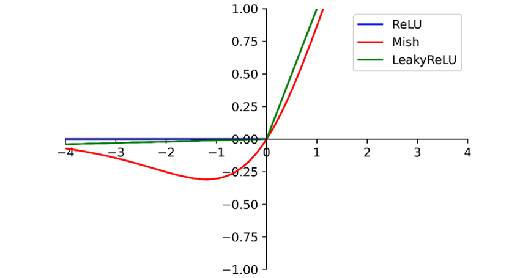
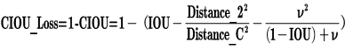
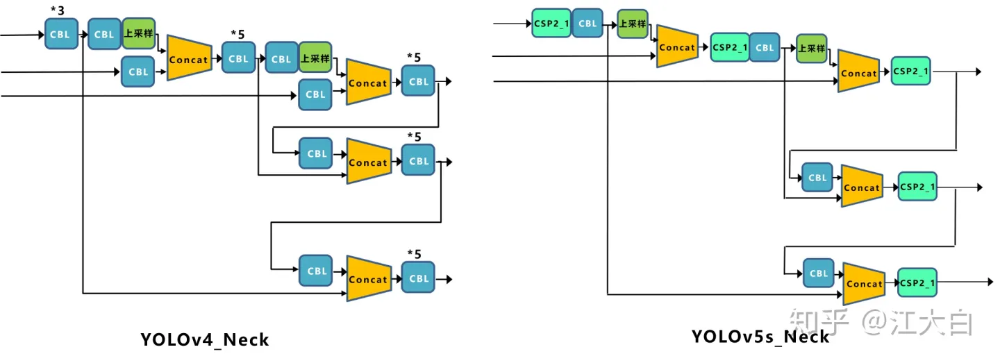

# YOLO algorithm

> "YOLO may not be the best detector, but it is the most colorful one."


### single-shot vs two-shot:

**end-to-end**/single-shot detector: both detection and classification

looking for specific bounding boxes

vs two-shot/two-stage: first draw bounding box, then classify it

**yolo's contribution**: 

all focus on speed 

single-shot detector

- like object localization task (vs sliding window):
  - output bounding boxes of any aspect ratio
  - output more precise coordinates that aren't just dictated by the stripe size of the sliding window classifier

- **convolutional implementation:** choose the conv layers and the max pool layers so that this eventually maps to a 3 by 3 by 8 output volume.
  - can extract information $p_c$, bounding box coordinates $b_x, b_y, b_h, b_w$ and class labels $c_1,c_2,c_3$ from each $\mathbf y$

**problems**

multiple object assigned to one grid cell? 

- use finer grid to reduce chance

one instance across grid

- assign object to grid cell by its midpoint

- can go across grid(bw, bh > 1)

  

### IoU (Intersection over Union)


### Non-max Suppresion

make sure each object is detected only once


**problem:** calculate probability for each class i:  $p_{i} = p_c \cdot c_i$

 [Weekly Assignment - Car detection with YOLO](https://www.coursera.org/learn/convolutional-neural-networks/programming/3VCFG/car-detection-with-yolo/lab?path=%2Fnotebooks%2FW3A1%2FAutonomous_driving_application_Car_detection.ipynb#) 

### Anchor boxes

detect overlapping objects


problem:

- three objects but two anchor boxes
- two object with exactly same-shape anchor box
  - later YOLO version: k-means to find similar-shape objects

more for specification

*in practice, this does not happens often in 19 by 19 grid cell*

## Detection model architecture

A detection model contains a **backbone, neck, head** module. 


- **backbone: **exploits the essential features of different resolutions
- **neck: ** fuses the features of different resolutions.
- **multiple head modules: ** perform the detection of objects in different resolutions.


## Incremental Improvements

 [Different YOLO versions under 10 mins - YouTube](https://www.youtube.com/watch?v=KWK4e7QNW-4) 

v1-v3 introduced by [Joseph Redman](), later Alex and Glenn

#### **yolo v1**

original resolution

limitation: 

"all things equall": struggle with small objects, especially further from frames

cap for number of classes: cannot have more than 10 objects in a row


#### **yolo v2 (yolo-9000)**

 *"faster, better, stronger"*

better

BN layer

higher resolution classifier -> 448

anchor box

dimension clutters using k-means

fine-grained features

Darknet-19

(all FC layer removed -- faster)

**hierachical classification** -- stronger

#### yolo v3

darknet-53 as feature extractor 

residual connections [Alphago paper graph]()

implemented in other framework(keras); connect to pytorch by Glenn Jocher for particle research

#### yolo v4

data augmentation and preprocessing

also in other framework; 

CSPNet

#### yolo v5

[Object Detection Algorithm — YOLO v5 Architecture | by Surya Gutta | Analytics Vidhya](https://medium.com/analytics-vidhya/object-detection-algorithm-yolo-v5-architecture-89e0a35472ef) 

(no paper, just a github repo)

fully implemented on pytorch by Glenn Jocher

getting to production quickly: ease-of-use, exportabiity, memory requirements, speed, mAP, market size

*non-sequential, a community that all forks make contribution to it*


## DarkNet


基本结构：Residual Block

- **block：**1x1卷积层 + 3x3卷积层，比ResNet的bottleneck block少了后面的1x1卷积层；第二层kernel数量是第一层的两倍。
- **activation:** leaky_relu


## YoloV4

[深入浅出Yolo系列之Yolov3&Yolov4&Yolov5&Yolox核心基础知识完整讲解 - 知乎](https://zhuanlan.zhihu.com/p/143747206) 

1. **输入端：**这里指的创新主要是训练时对输入端的改进，主要包括**Mosaic数据增强、cmBN、SAT自对抗训练**
2. **BackBone主干网络：**将各种新的方式结合起来，包括：**CSPDarknet53、Mish激活函数、Dropblock**
3. **Neck：**目标检测网络在BackBone和最后的输出层之间往往会插入一些层，比如Yolov4中的**SPP模块**、**FPN+PAN结构**
4. **Prediction：**输出层的锚框机制和Yolov3相同，主要改进的是训练时的损失函数**CIOU_Loss**，以及预测框筛选的nms变为**DIOU_nms**


### 输入数据

大小：$608*608*3$

#### Mosaic数据增强

问题：

- 小目标(定义为32*32以下的目标)预测难度大，AP普遍比中大目标低；
- 同时Coco数据集上小目标数量多，分布不均。


为解决小目标预测的问题，作者采用了Mosaic数据增强的方式：

1. **丰富数据集：**随机使用**4张图片**，随机缩放，再随机分布进行拼接，大大丰富了检测数据集，特别是随机缩放增加了很多小目标，让网络的鲁棒性更好。
2. **减少GPU：**可能会有人说，随机缩放，普通的数据增强也可以做，但作者考虑到很多人可能只有一个GPU，因此Mosaic增强训练时，可以直接计算4张图片的数据，使得Mini-batch大小并不需要很大，一个GPU就可以达到比较好的效果。

> 此外，发现**[另一研究者的训练方式](https://www.zhihu.com/question/390191723?rf=390194081) **也值得借鉴，采用的数据增强和Mosaic比较类似，也是使用**4张图片**（**不是随机分布**），但训练计算loss时，采用“**缺啥补啥**”的思路：
>
> 如果上一个iteration中，小物体产生的**loss不足**（比如小于某一个阈值），则下一个iteration就用**拼接图**；否则就用**正常图片**训练，也很有意思。

### Backbone

#### CSP

[paper](https://arxiv.org/pdf/1911.11929v1.pdf) 

[Review — CSPNet: A New Backbone That Can Enhance Learning Capability of CNN | by Sik-Ho Tsang | Medium](https://sh-tsang.medium.com/review-cspnet-a-new-backbone-that-can-enhance-learning-capability-of-cnn-da7ca51524bf)  

[CSPDarkNet结构解析及PyTorch实现 - 知乎](https://zhuanlan.zhihu.com/p/263555912) 

#### CSPDarkNet as Backbone


**CSPDarknet53**是在Yolov3主干网络**Darknet53**的基础上，借鉴**2019年CSPNet**的经验，产生的**Backbone**结构，其中包含了**5个CSP**模块。

- 

每个CSP模块前面的卷积核的大小都是**3\*3**，stride=2，因此可以起到**下采样**的作用。

因为Backbone有5个**CSP模块**，输入图像是**608\*608**，所以特征图变化的规律是：**608->304->152->76->38->19**

经过5次CSP模块后得到19*19大小的特征图。

而且作者只在Backbone中采用了**Mish激活函数**，网络后面仍然采用**Leaky_relu激活函数。**

#### Cross Stage Partial DenseNet

CSPNet全称是Cross Stage Paritial Network，主要从网络结构设计的角度解决推理中从计算量很大的问题。

CSPNet的作者认为推理计算过高的问题是由于网络优化中的**梯度信息重复**导致的。

因此采用CSP模块先将基础层的特征映射划分为两部分，然后通过跨阶段层次结构将它们合并，在减少了计算量的同时可以保证准确率。

**problem:** [DenseNet](densenet.cmd) - duplicate gradient information

- DenseNet concatenate input and output of layer i as input of layer i+1

  

- during BP, lots of gradients information are reused

  


- **separates feature map of the base layer into two part**

  - HOW to seperate? 
  - one part will go through a dense block and a transition layer; 
  - the other one part is then combined with transmitted feature map to the next stage.
  - The gradients coming from the dense layers are separately integrated.

- > *The proposed CSPDenseNet* **preserves the advantages of DenseNet’s feature reuse characteristics**but at the same time **prevents an excessively amount of duplicate gradient information** *by truncating the gradient flow.*
  >
  > 
  >
  > 

#### Partial Dense Block Variants


two variants for partial trainsition layers to **maximize the difference of gradient combination**:

- **Fusion First:** concatenate two parts, then trainsion
  - a large amount of gradient information **will be reused**
  - **Fusion Last: dense block go through transition first, then concatenate**
    - **gradient information will \**not\** be reused since the gradient flow is \**truncated\**.**
    - **computation cost significantly dropped, accuracy ~same**

#### **Applying CSPNet to Other Architectures**

- CSPNet can be also easily applied to [ResNet](https://towardsdatascience.com/review-resnet-winner-of-ilsvrc-2015-image-classification-localization-detection-e39402bfa5d8?source=post_page---------------------------) and [ResNeXt](https://towardsdatascience.com/review-resnext-1st-runner-up-of-ilsvrc-2016-image-classification-15d7f17b42ac?source=post_page---------------------------).

  - no need for bottleneck layer

  

#### Mish激活函数

 [Meet Mish — New State of the Art AI Activation Function. The successor to ReLU? | by Less Wright | Medium](https://lessw.medium.com/meet-mish-new-state-of-the-art-ai-activation-function-the-successor-to-relu-846a6d93471f) 

[paper](https://arxiv.org/abs/1908.08681) 


$$
LeakyRelu(x) = 

\begin{cases} 
x \ & \text{if} \ x>0 \\

\lambda x \ & \text{if} \ x<=0\end{cases} \\
\\
\begin{align}
Mish(x) & =  x \cross \tanh(softplus(x))  \\
			& = x \cross  \tanh(\ln(1+ e^x))
	\end{align}
$$

- non-monotonic
- first derivative behavior may be acting as a **regularizer** 
- 处处平滑
- 无正向边界，避免饱和



#### Dropblock

目标--正则化

传统的Dropout：**随机删除减少神经元的数量，使网络变得更简单。**


而Dropblock和Dropout相似，比如下图：


**Dropblock实现借鉴了Dropout和Cutout的优势：**

- Dropout: 单个神经元随机丢弃

  - 卷积层对于Dropout这种随机丢弃并不敏感：

    >  因为卷积层通常是三层连用：**卷积+激活+池化层**，池化层本身就是对相邻单元起作用。而且即使随机丢弃，卷积层仍然可以从相邻的激活单元学习到**相同的信息**。

  - 因此，Dropout在卷积层上**效果并不好**

- **Dropblock**: 整个局部区域进行删减丢弃。

  - 借鉴2017年的**cutout数据增强**

    - cutout: 将**输入图像**的部分区域清零，而Dropblock则是将Cutout应用到**每一个特征图**。

    - 而且并不是用固定的归零比率，而是在训练时以一个小的比率开始，随着训练过程**线性的增加这个比率**。

      

- 优势：

  - Dropblock效果优于Cutout 
  - Cutout只能作用于输入层，而Dropblock则是将Cutout应用到网络中的每一个特征图上
  - 可以定制各种组合，在训练的不同阶段可以修改删减的概率，从空间层面和时间层面和Cutout相比都有更精细的改进。

**Yolov4**中直接采用了更优的**Dropblock**，对网络的**正则化过程**进行了全面的升级改进。

----

### Neck

目标检测领域，为了**更好的提取融合特征**

#### SPP

**SPP - Spatial Pyramid Pooling 空间金字塔池化**


- 使用k={1*1,5*5,9*9,13*13}的**max pooling**
  - padding=same, stride=1, 所以输入输出特征图大小相同
- 再将不同尺度的特征图进行**Concat**操作

vs单纯使用**k\*k最大池化**的方式：更有效的**增加主干特征的接收范围**，显著的**分离了最重要的上下文特征**。

#### PFN+PAN


最后的**Prediction**中用于预测的三个特征图**①19\*19\*255、②38\*38\*255、③76\*76\*255。[注：255表示80类别(1+4+80)×3=255]**

FPN：自顶向下，将高层的特征信息通过**上采样**的方式进行传递融合，得到进行预测的特征图。


和Yolov3的FPN层不同，Yolov4在FPN层的后面还添加了一个**自底向上的特征金字塔。**


这样结合操作，FPN层自顶向下传达**强语义特征**，而特征金字塔则自底向上传达**强定位特征**，两两联手，从不同的主干层对不同的检测层进行参数聚合,这样的操作确实很皮。


----

### Prediction

#### Bounding Box Loss

**IOU_loss** =1- IOU

问题：

- （状态1）预测框和目标框不相交，loss=0且不可导，无法优化

- （状态2和3）预测框面积相等且重叠面积相等，则无法区分两者相交情况的不同。

  


#### **GIOU_Loss**

缓解了一部分IoU Loss的尴尬

- 不重叠：loss>1，越远loss越大
- 重叠面积相等：外框和差集不相等，可区分


问题：预测框在目标框内且大小相同，这时差集也相同，GIOU无法区分相对位置关系。

#### DIOU_loss

**DIOU_Loss：**在IOU和GIOU的基础上，考虑边界框中心点距离的信息。

好的目标框回归函数应该考虑三个重要几何因素：**重叠面积、中心点距离，长宽比。**


DIOU_Loss考虑重叠面积和**中心点距离**：

$\text{DIOU Loss} = 1-(IOU-\frac{distance_2 }{distance_C})$

- （相当于对中心点距离归一化处理）

- distance_2: 中心点距离

- distance_C: 最小外接矩形的对角线距离

缺点：没有考虑到长宽比


#### CIOU_Loss



其中$v$是衡量长宽比一致性的参数，我们也可以定义为：


#### IOU_Loss的演化历程

**IOU_Loss：**主要考虑检测框和目标框重叠面积。

**GIOU_Loss：**在IOU的基础上，解决边界框不重合时的问题。

**DIOU_Loss：**在IOU和GIOU的基础上，考虑边界框中心点距离的信息。

**CIOU_Loss：**在DIOU的基础上，考虑边界框宽高比的尺度信息。

### DIOU_nms

在non-max suppresion计算汇总把IOU替换为DIOU


#### 

## YoloV5

 [深入浅出Yolo系列之Yolov5核心基础知识完整讲解 - 知乎](https://zhuanlan.zhihu.com/p/172121380) 

### 预处理

#### 自适应锚框计算

在Yolov3、Yolov4中，训练不同的数据集时，计算初始锚框的值是通过单独的程序运行的。

但Yolov5中将此功能嵌入到代码中，每次训练时，自适应的计算不同训练集中的最佳锚框值。

#### 自适应图片缩放

作者认为，在项目实际使用时，很多图片的长宽比不同，因此缩放填充后，两端的黑边大小都不同，而如果填充的比较多，则存在信息冗余，影响推理速度。

因此在Yolov5的代码中datasets.py的letterbox函数中进行了修改，对原始图像**自适应的添加最少的黑边**。

图像高度上两端的黑边变少了，在推理时，计算量也会减少，即目标检测速度会得到提升。

### Backbone

#### Focus结构


比如右图的切片示意图，4*4*3的图像切片后变成2*2*12的特征图。

以Yolov5s的结构为例，原始608*608*3的图像输入Focus结构，采用切片操作，先变成304*304*12的特征图，再经过一次32个卷积核的卷积操作，最终变成304*304*32的特征图。

#### CSP结构

Yolov5与Yolov4不同点在于，Yolov4中只有主干网络使用了CSP结构。

而Yolov5中设计了两种CSP结构，以**Yolov5s网络**为例，**CSP1_X结构**应用于**Backbone主干网络**，另一种**CSP2_X**结构则应用于**Neck**中。


### Neck

Yolov4的Neck结构中，采用的都是普通的卷积操作。而Yolov5的Neck结构中，采用借鉴CSPnet设计的CSP2结构，加强网络特征融合的能力。




### 输出

#### Loss

classification loss + bounding box loss

bounding box loss：和v4一样，Yolov5中采用[CIOU_Loss](####CIOU_Loss)


#### nms

和v4一样，Yolov5中采用[DIOU_nms](####DIOU_nms)


## yolo训练和调优

```bash
%run train.py --weights yolov5x.pt --cfg models/yolov5x.yaml --data data/table-dataset.yaml --device 0 --workers 0 --batch-size 4

%run detect.py --weights best.pt --img 640 --conf 0.4 --source yolov5/data/image_form --device cpu --save-crop --save-txt

%run detect.py --weights runs/train/exp12/weights/best.pt --source dataset/test_img --device cpu --save-crop --save-txt


```


 [训练yolo V4模型调优的十个建议](https://blog.csdn.net/fengmaomao1991/article/details/114081618) 

VOC dataset format

**--weights**: specify pretrained models

- **pretrained** `--weights yolov5s.pt` (recommended)
- randomly initialized `--weights '' --cfg yolov5s.yaml` (not recommended)

**--conf**: (default 0.25 --> 0.4)

confidence thresh for non max suppresion


## yolo损失函数

 [Detector Loss function (YOLO loss) - Hands-On Convolutional Neural Networks with TensorFlow [Book]](https://www.oreilly.com/library/view/hands-on-convolutional-neural/9781789130331/8881054c-f6e6-485c-9c9e-357285bce60a.xhtml) 

 [Real-time Object Detection with YOLO, YOLOv2 and now YOLOv3 | by Jonathan Hui | Medium](https://jonathan-hui.medium.com/real-time-object-detection-with-yolo-yolov2-28b1b93e2088) 

 [neural networks - Yolo Loss function explanation - Cross Validated](https://stats.stackexchange.com/questions/287486/yolo-loss-function-explanation) 

#### 

$$
\begin{align}
\text{LOSS} =  & \text{bounding box loss} \\

 & + \ \text{confidence loss} \\

 & + \ \text{classification loss} \\
 \end{align}
$$

#### [bounding box loss (localization loss)](####Bounding-Box-Loss)

#### confidence loss

#### classification loss


yoloV4的损失函数：


#### 
