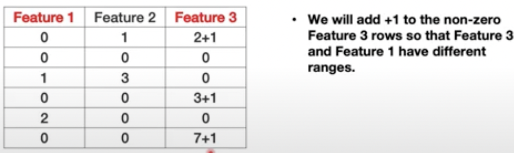
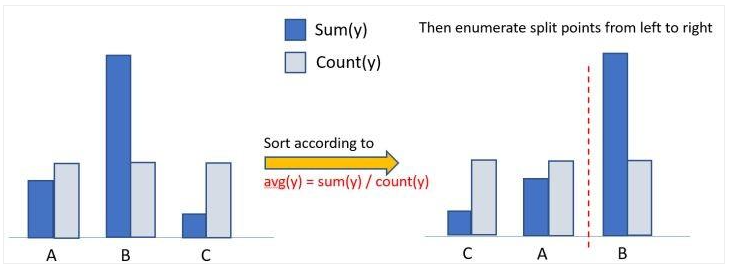

# LGBM

[Kaggle Tutorial](https://www.kaggle.com/code/prashant111/lightgbm-classifier-in-python/notebook)

 [XGBoost vs LightGBM: How Are They Different - neptune.ai](https://neptune.ai/blog/xgboost-vs-lightgbm) 

 [What makes LightGBM lightning fast? | by Abhishek Sharma | Towards Data Science](https://towardsdatascience.com/what-makes-lightgbm-lightning-fast-a27cf0d9785e)  

[Run through LightGBM Fast Training Techniques | by Summer Hu | The Startup | Medium](https://medium.com/swlh/understand-lightgbm-fast-training-techniques-8dab16487cd5) 

### (vs XGBoost: )

significantly faster, almost equivalent result

XGBoost faster on CPU

LGBM faster on GPU

## Algorithm

### histogram-based algorithm

idea: perform bucketing of feature values to reduce time and computation for finding the best splitting

vs pre-sorted splitting: 

- faster
- require less memory
- ~higher regularization
  - number of bins = degree of regularization
- histogram is additive
  - for comp. optimization
  - Parent Node Histogram = Left Child Histogram + Right Child Histogram

#### leaf-wise (vertical) growth

XGBoost and most other Tree Algorithms: level-wise tree growth

*In Leaf-wise strategy, every time from all the leaves, find the leaf with the highest split gain, then split and cycle.*

- more loss reduction so higher accuracy and faster
- may also result in overfitting 
  - could be handled using the max-depth parameter

### Gradient-Based One-Side Sampling (GOSS)

 [DTEL5 5 5 LightGBM - YouTube](https://www.youtube.com/watch?v=NsCdkzi2soE) 

idea: focus more on under-trained data

use gradients as **measure of importance**:

- small gradient: means small error, data point is learned well (important)
- large gradient: means learge error, the data point is not learned well (important)

**algorithm:**

- sort the data accoding to the absolute garadient value
- keep the top $a*100 \%$ of the data samples(large gradients)
- randmly sample $b * 100 \%$ from the rest of the data(small gradients)
- (to maintain the original distribution) amplify small gradients by multiplying $\frac{1-a}{b}$ when calculating information gain

### Exclusive Feature Bundling (EFB)

idea: efficient representation for sparse features, especially one-hot encodings (reduce number of features)

**mutally exclusive features:** never non-zero simultaneously (or $<threshold$)

- main observation: that many features are never non-zero together and their **ranges do not overlap** (如果overlap需要人为加上offset把值域分开）. 

- Therefore, we can **merge(bundle)** them and save space by doing that

- > sample query: 
  >
  > $>2:$  Feature 3
  >
  > $\leq 2$: Feaure 1

algorithm:

1. Construct a graph with weighted (**measure of conflict** between features) edges. Conflict is measure of the *fraction of exclusive features* which have overlapping non zero values.
2. Sort the features by *count of non zero instances* in descending order.
3. Loop over the ordered list of features and assign the feature to an existing bundle (if conflict < threshold) or create a new bundle (if conflict > threshold).

### handling categorical values

**XGBoost:** by default, treat as numerical variables with order

### many-vs-many Split for Categorical Features

**one-vs-many:**

- imbalance
- lots of splits -> very deep tree

**algorithm:** 

For a given categorical feature

1. For each category of the feature, calculate mean value Sum(y)/Count(y)
2. Sort all categories by its mean value(indicated by below picture).
3. Enumerate split value from the lowest mean value to largest mean value to find best splitting value. 
   - The split value groups all categories into two parts(category mean value less than or large than splitting value) and that is the node splitting condition.

# XGBoost

 [XGBoost Part 1 (of 4): Regression - StatQuest - YouTube](https://www.youtube.com/watch?v=OtD8wVaFm6E) 

 [XGBoost Part 3 (of 4): Mathematical Details - YouTube](https://www.youtube.com/watch?v=ZVFeW798-2I) 

[How to Control Your XGBoost Model | Capital One](https://www.capitalone.com/tech/machine-learning/how-to-control-your-xgboost-model/) 

[Parallel Gradient Boosting Decision Trees](http://zhanpengfang.github.io/418home.html) 

XGBoost用的是CART树

### XGBoost Regression Tree

$similarity = \frac{\text{sum of residuals, squared}}{\text{number of residuals} + \lambda}$

$output value = \frac{\text{sum of residuals}}{\text{number of residuals} + \lambda}$

lambda: regularization parameter, reduce the prediction's sensitivity to individual observations to prevent overfitting

- smaller gain, 
- easier to prune

$prediction_{new} = prediction_{old} + \eta * value of node$

### Classification Tree

$similarity = \frac{\text{sum of residuals, squared}}{\sum [prob_{previous} \cdot (1 - prob_{previous})] + \lambda}$

cover  - $\sum$ term 

- default value for cover = 1

### Taylor Expansion

 [XGBoost Part 3 (of 4): Mathematical Details - YouTube](https://www.youtube.com/watch?v=ZVFeW798-2I) 

### XGBoost vs GBDT

[机器学习算法中 GBDT 和 XGBOOST 的区别有哪些？ - 知乎](https://www.zhihu.com/question/41354392) 

- XGBoost is **more regularized** [StatQuest's example](https://youtu.be/OtD8wVaFm6E?t=923)

  - 显示的将模型复杂度作为正则项加在目标函数里

  > xgboost used a **more regularized** model formalization to control over-fitting, which gives it better performance.

- xgboost里面的基学习器除了用tree(gbtree)，也可用**线性分类器**(gblinear)
- 公式推导里用到了二阶导数信息（泰勒展开），而普通的GBDT只用到一阶

- computational power: improved speed and memory utilization 

  - Use of sparse matrices with sparsity aware algorithms
  - Improved data structures for better processor cache utilization which makes it faster.
  - Better support for [paralleled processing](http://zhanpengfang.github.io/418home.html) which reduces overall training time. 

  > The name xgboost, though, actually refers to the engineering goal to **push the limit of computations resources for boosted tree algorithms**. Which is the reason why many people use xgboost. For model, it might be more suitable to be called as regularized gradient boosting.
  >
  > The OP also asked why xgboost is so fast. The reason is that while it is not possible to paralelize the ensemble itself because each tree is dependent on the previous, **you can paralelize the building of the several nodes within each depth of each tree**. These types of details is what makes xgboost so fast. 

### Pruning

[StatQuest's example](https://youtu.be/OtD8wVaFm6E?t=782)

1. choose a value for pruning parameter $\gamma$

   - gamma = 0 does not turn off pruning [example](https://youtu.be/OtD8wVaFm6E?t=1075)

2. build a full tree with `max_depth` first

3. for each branch, starting from the bottom up, looks to see if the **gain** falls below $\gamma$. 

   $gain = similarity_{right} + similarity_{left} - similarity_{parent}$

   - **prune** and move up if the first node encountered has a gain value lower than $\gamma$.
   - do not prune and **stop** if the node has gain higher than $\gamma$, the node is left and the pruner **does not check the parent nodes.**

### When not to use XGBoost?

1. Image Recognition, Computer Vision

2. 数据量远小于特征量（易overfit）

   

### ==Q：==

==为什么可以用Squared SR表示similarity，为什么:==

我的理解：

对于每一棵树，我的预测目标是把相似（在预测值同一边且距离相近）的数据分到一起，而不是直接这样预测出的（残差）值即离那些点的距离值，就可以用于修正我的预测值。

SR-similarity越大越好：离得远没关系，但要是同一边的值一起离得远。**因为目的是分组**，分的越纯越好，分的远的数据越多越好；距离远下一次迭代用残差就修正了。

==lambda和gamma都是可以控制overfitting的参数？==

lambda如何实现正则化？如何控制overfitting(通过剪枝吗)？

==为什么需要minimum cover value？==

==classification - log（odds）转换 p==

==min_child weight超参数==

min_child_weight(hessian) = $\min \sum_{i \in instance} h_i$

 [machine learning - Explanation of min_child_weight in xgboost algorithm - Cross Validated](https://stats.stackexchange.com/questions/317073/explanation-of-min-child-weight-in-xgboost-algorithm) 

## appendix 

### XGBoost parameters

Here are the most important XGBoost parameters:

1. ***n_estimators [default 100] –\*** Number of trees in the ensemble. A higher value means more weak learners contribute towards the final output but increasing it significantly slows down the training time. 
2. ***max_depth [default 3] –\*** This parameter decides the complexity of the algorithm. The lesser the value assigned, the lower is the ability for the algorithm to pick up most patterns (underfitting). A large value can make the model too complex and pick patterns that do not generalize well (overfitting).
3. ***min_child_weight [default 1] –\*** We know that an extremely deep tree can deliver poor performance due to overfitting. The min_child_weight parameter aims to regularise by limiting the depth of a tree. So, the higher the value of this parameter, the lower are the chances of the model overfitting on the training data.
4. ***learning_rate/ eta [default 0.3] –\*** The rate of learning of the model is inversely proportional to the accuracy of the model. Lowering the learning rate, although slower to train, improves the ability of the model to look for patterns and learn them. If the value is too low then it raises difficulty in the model to converge.
5. ***gamma/ min_split_loss [default 0] –\*** This is a regularization parameter that can range from 0 to infinity. Higher the value, higher is the strength of regularization, lower are the chances of overfitting (but can underfit if it’s too large). Hence, this parameter varies across all types of datasets.
6. ***colsample_bytree [default 1.0] –\*** This parameter instructs the algorithm on the fraction of the total number of features/ predictors to be used for a tree during training. This means that every tree might use a different set of features for prediction and hence reduce the chances of overfitting and also improve the speed of training as not all the features are being used in every tree. The value ranges from 0 to 1.
7. ***subsample [default 1.0] –\*** Similar to colsample_bytree, the subsample parameter instructs the algorithm on the fraction of the total number of instances to be used for a tree during training. This also reduces the chances of overfitting and improves training time.

Find more parameters [here](https://xgboost.readthedocs.io/en/stable/parameter.html).

### LightGBM parameters

Here are the most important LightGBM parameters:

1. ***max_depth –\*** Similar to XGBoost, this parameter instructs the trees to not grow beyond the specified depth. A higher value increases the chances for the model to overfit.
2. ***num_leaves –\*** This parameter is very important in terms of controlling the complexity of the tree. The value should be less than 2^(max_depth) as a leaf-wise tree is much deeper than a depth-wise tree for a set number of leaves. Hence, a higher value can induce overfitting.
3. ***min_data_in_leaf –\*** The parameter is used for controlling overfitting. A higher value can stop the tree from growing too deep but can also lead the algorithm to learn less (underfitting). According to the LightGBM’s official documentation, as a best practice, it should be set to the order of hundreds or thousands.
4. ***feature_fraction –\*** Similar to *colsample_bytree* in XGBoost
5. ***bagging_fraction –\*** Similar to *subsample* in XGBoost

Find more parameters [here](https://lightgbm.readthedocs.io/en/latest/Parameters.html).
