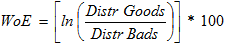
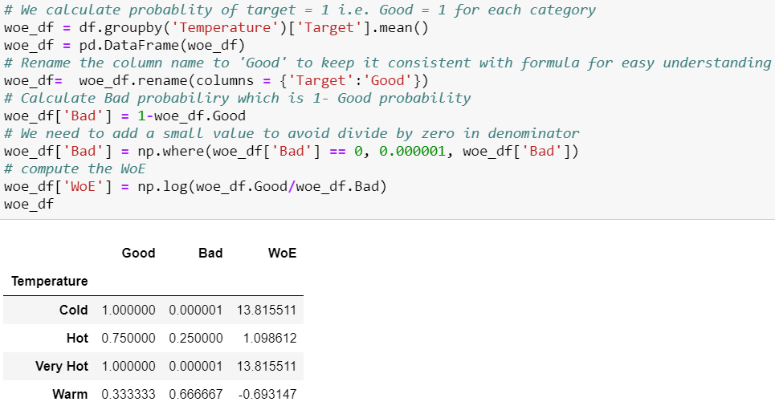
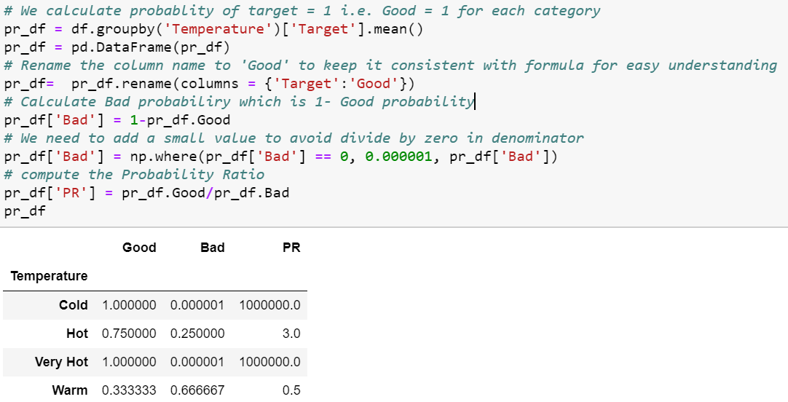
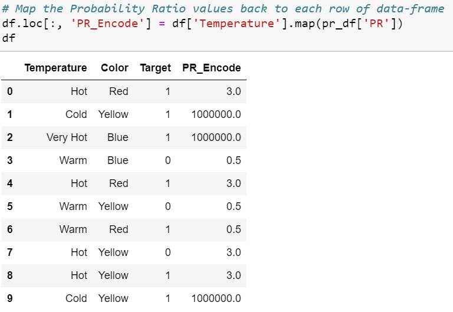

# Embedding

## tensorflow: embedding categorical variables

[`tf.feature_column.categorical_column_with_vocabulary_list`](https://www.tensorflow.org/api_docs/python/tf/feature_column/categorical_column_with_vocabulary_list): takes a vocabulary list specifying all the values the feature can take.

Then each id is mapped to an embedding vector using [`tf.feature_column.embedding_column`](https://www.tensorflow.org/api_docs/python/tf/feature_column/embedding_column).

[example: ](https://colab.research.google.com/github/google/eng-edu/blob/main/ml/recommendation-systems/recommendation-systems.ipynb?authuser=1#scrollTo=VZB1J8l9o4ul)

```python
# Create feature embedding columns
def make_embedding_col(key, embedding_dim):
  categorical_col = tf.feature_column.categorical_column_with_vocabulary_list(
      key=key, vocabulary_list=list(set(movies[key].values)), num_oov_buckets=0)
  return tf.feature_column.embedding_column(
      categorical_column=categorical_col, dimension=embedding_dim,
      # default initializer: trancated normal with stddev=1/sqrt(dimension)
      combiner='mean')
```

## [categorical encoding](https://towardsdatascience.com/all-about-categorical-variable-encoding-305f3361fd02) 

### One-Hot Encoding

### Label Encoding

### Weight of Evidence(WoE) Encoding

- 衡量一个分组方式**对于区分好、坏样本的效果**，最初用于搭建判断信用卡负债风险的预测模型。
- 用于衡量证据支持/反驳假设的程度。



- $0$ if $P(Goods) / P(Bads) = 1$ (random)

  $<0$ if $P(Bads) > P(Goods)$ 

  $>0$ if $P(Goods) > P(Bads)$ 

- well suited for Logistic Regression

  - because the Logit transformation is simply the log of the odds, i.e., $\ln(P(Goods)/P(Bads))$
  - so the predictors are prepared and coded to the same scale,  parameters can be directly compared.

#### 实现



### Probability Ratio Encoding: 

- 例：性别预测中的男性安装app比例、男性安装app类别的比例
- 和WoE类似，但PR直接使用正、负样本概率的比例
- 对于每个特征值，将特征值替换为$P(Goods)/P(Bads)$
- 需定义$P(0)$最小值（防止溢出）

#### 实现





## encoding vs embedding

[source](https://ai.stackexchange.com/questions/31632/can-i-always-use-encoding-and-embedding-interchangeably#:~:text=Encoding%20is%20related%20to%20decoding,category%2C%20e.g.%20differential%20manifolds)

embedding和encoding两个词主要来源于自然语言处理领域，代表对于词语的的数字化表征。

### **相似点**

都表示对于初始特征的转化，如$X$ 到$X^-$

### **不同点**

1）根据attention is all you need的原文，encoding更多表示对特征的一种**公式型**转化，比如利用三角函数等这样相对**白盒**一点的转化方法；而embedding更多指的是一种基于神经网络的转化方法，比如把一个19维的特征映射为一个8维的特征。
2）一般认为encoding是一个过程，从$X$到$X^-$的过程；而embedding是结果，$X^-$就是$X$的embedding。
3）embedding是**包含语义信息**的encoding，但并非所有的encoding都一定包含语义信息，比如one hot encoding. 

