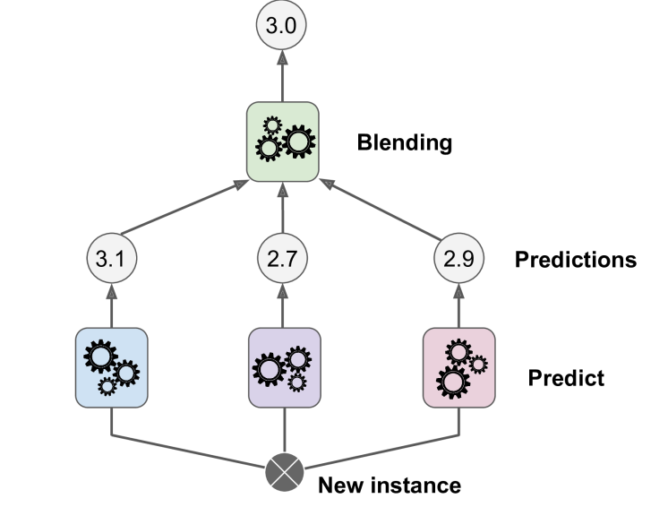
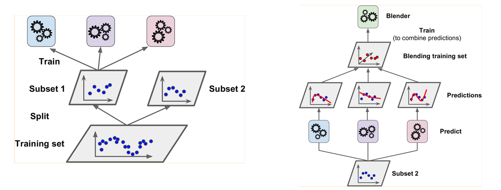

# GBDT

## Ensemble learning

- multiple weak learners -> one strong learner
  - weak learner: slightly better than random

- usually **generalize** better than a single strong learner

### bagging

- bagging = boostrap + aggregating
- bootstrap - sample with replacement
  - combine(aggregate) by voting(classification)/average(regression)

- pasting - sample without replacement

### boosting

- a sequential learning process
  - cannot be parallelized

- each predictor learn the **residual**(error) of the previous predictor

### stacking

train a model for aggregating - **'meta leaner'** or **'blender'**

##### train with hold-out dataset

1. split train-test set

2. use train data to train n weak learners 

3. use these weak models to predict test data

   需要使用test set的原因：防止数据泄露。弱学习器不使用test set数据进行训练，所以没见过预测数据。

4. use n precitions + 1 GT label as new train data to train the blender model

## algorithms

### Adaboost

focus on the harder example 

### GBDT

 [Gradient Boosting Trees for Classification: A Beginner’s Guide - by Aratrika Pal - The Startup - Medium](https://medium.com/swlh/gradient-boosting-trees-for-classification-a-beginners-guide-596b594a14ea) 

#### learning rate

prevent overfitting by making a smaller step everytime you update by predicting the residual
$$
final \ \log(odds) \ prediction = \\intial \ prediction + lr \cross predicted \ residual_1 \\ + lr \cross predicted \ residual_2 + ....
$$

## 