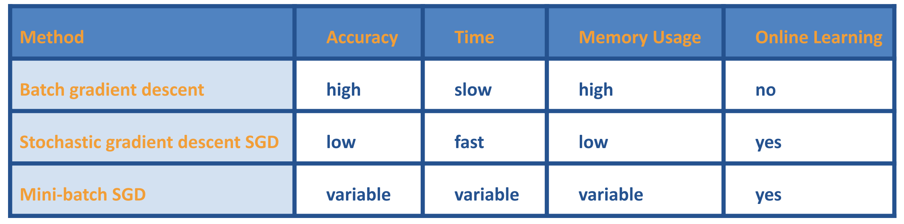

b梯度下降 Gradient Descent

## 梯度消失与爆炸问题
### 梯度消失

$|gradient| \rightarrow 0$
- RNN, $|single\ gradient| < 1$
- sigmoid

### 梯度爆炸
$|gradient| \rightarrow \infin$
- RNN, $|single\ gradient| > 1$

## 激活函数
> "I think we are in a stage of alchemy and we haven't invented chemistry yet."

### Sigmoid
> 梯度消失问题

### Relu
> 为什么relu不会有梯度消失？
Expectation: 一半的时间梯度不会为0

### LeakyRelu
改善了Relu，负的部分也不为0。
表现大体和Relu相同

----
*可能因为上述原因，在很多超大的神经网络中，存在很多“dead neurons”（权值一直为0）。但因为神经元数巨大，所以不造成影响。*

## Batch GD vs SGD:

## 其他优化方法

### 最速下降法

最速下降法（Steepest descent）是梯度下降法的一种更具体实现形式，其理念为在每次迭代中选择合适的步长 𝛼𝑘，使得目标函数值能够得到最大程度的减少。

每一次迭代，沿梯度的反方向，我们总可以找到一个 **𝑥**(𝑘+1)=**𝑥**(𝑘)−𝛼𝑘∇𝑓(**𝑥**(𝑘))，使得在这个方向上 f(x(k+1)) 取最小值。即
$$
𝛼_𝑘=\arg\min_{𝛼≥0}𝑓\Big(x^{(𝑘)}−𝛼∇𝑓(x^{(𝑘)})\Big)
$$
特性：

- 最速下降法每次更新的轨迹都和上一次垂直。
- 只要梯度 ∇𝑓(**𝑥**(𝑘))≠0，则 $𝑓(𝑥^{(𝑘+1)}) < 𝑓(𝑥^{(𝑘)})$。（即梯度不等于 0 时，肯定会下降。）

### 牛顿法

牛顿法的基本思路是在每次迭代中，利用二次型函数来局部近似目标函数 𝑓f，并求解近似函数的极小点作为下一个迭代点，牛顿法自变量 **𝑥**x 的更新公式为：
$$
x^{(𝑘+1)}=x^{(𝑘)}−𝐹(x^{(𝑘)})^{-1} \grad 𝑓(x^{(𝑘)})
$$

- 不能保证收敛到极值：

  当起始点 $𝑥(0)$ 离极值点 $x^*$ 足够近的时候，上面的更新公式没有问题。

  但是，当 $x(0)$ 离极值点 $x^*$ **较远**时，我们并不能保证牛顿法能收敛到极值点。

- 不保证是 descent 的，即可能 $𝑓(𝑥^{(𝑘+1)}) \geq 𝑓(𝑥^{(𝑘)})$。
  - 黑塞矩阵如果不是正定的，那就要对牛顿法进行修正，确保descent。如 Levenberg-Marquardt 修正。

$$
x^{(𝑘+1)}=x^{(𝑘)}−\alpha_k \big(𝐹(x^{(𝑘)}) + \mu_kI \big)^{-1} \grad 𝑓(x^{(𝑘)}) 
$$
其中：

- $𝜇_𝑘≥0$ ，𝐼 为单位矩阵 
- 取适当的 $𝜇_𝑘$，使得 $𝐺=𝐹(x^{(𝑘)}) + \mu_kI$ 正定

### 拟牛顿法

牛顿法需要计算黑塞矩阵$𝐹(𝑥^{(𝑘)})$并且计算它的逆$𝐹(𝑥^{(𝑘)})^{-1}$，而求逆并不是很简单。

为了避免 $𝐹(𝑥^{(𝑘)})^{-1}$这种矩阵求逆运算，可以通过设计 的近$𝐹(𝑥^{(𝑘)})^{-1}$似矩阵来代替，这就是拟牛顿法的基本思路。

在拟牛顿法中，$𝐹(𝑥^{(𝑘)})^{-1}$近似矩阵 **𝐻**𝑘的构建只需要用到 **目标函数值** 和 **梯度**。

拟牛顿法的更新公式为：
$$
x^{(k+1)}=x^{(k)}−𝛼_𝑘𝐻_𝑘\grad f(x^{(k)} \\
$$

### 梯度下降法 vs 牛顿法

*comparison of gradient descent (green) and Newton’s method (red) for minimizing a function (with small step sizes)*

为什么**牛顿法会收敛更快**：

- 牛顿法是二阶收敛，梯度下降法是一阶收敛，所以牛顿法就更快。
- 更通俗地，梯度下降法只从当前位置选择一个坡度最大的方向走一步，而牛顿法在选择方向时，不仅会考虑坡度是否够大，还会考虑走了一步后，坡度是否会变得更大。
- 从几何上说，牛顿法就是用一个二次曲面去拟合当前位置的的局部曲面，而梯度下降法用的是一个平面去拟合，通常情况下，二次曲面的拟合会比平面更好，所以牛顿法选择的下降路径会更符合真实的最优下降路径。
- 

### 共轭方向法
