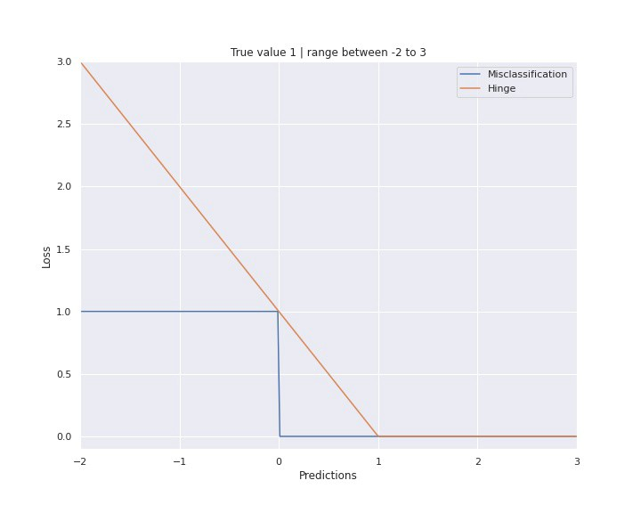

# Loss Functions 损失函数

## Loss, In general

## 分类

### Cross Entropy Loss 交叉熵损失函数

[交叉熵损失函数（CrossEntropy Loss）](https://blog.csdn.net/weixin_45665708/article/details/111299919) 

#### 信息量与信息熵（香农熵）

> 信息论（香农）：信息是用来消除随机不确定性的东西
>
> 例如：
>
> > 太阳从东方升起了。--事件发生的概率高，信息量小。
> >
> > 六月下雪了。 --事件发生的概率低，信息量大。

**信息量：** 
$$
I(x) = -\log P(x)
$$

motivation：

- 负的概率：一个事件包含的信息量的大小和事件发生的概率成反比
- 对数形式：多个事件发生的概率是多个事件概率相乘，总信息量是多个事件信息量相加

**信息熵：**

信息量度量的是某一个具体事件（某一种结果）所带来的信息，而信息熵则是在结果出来前对**可能产生的信息的期望**——考虑该随机变量的所有可能取值，即所有可能结果带来的信息量的期望。
$$
H(x) = E[I(x)] = - \sum _{x \in X} p(x) \log p(x)
$$

#### KL散度

*Average number of extra bits to represent an event from Q instead of P.*

KL散度即相对熵(relative entropy)，是两个概率分布之间差异的非对称性度量。相对熵等于两个信息熵的差值。

$$
\begin{align}
p(x)分布信息熵： \\
H_{pp} (X) &= -\sum _{i=1} ^ n p(x_i) \log p(x_i) \\
q(x)分布信息熵： \\
H_{pq} (X) &= -\sum _{i=1} ^ n p(x_i) \log q(x_i) \\
KL散度： \ \ \ \ \ \ \ \ \ \ \ \\\
D_{KL}(p||q) &= H_{pp}(X) - H_{pq}(X)  \\ &= -\sum _{i=1} ^ n p(x_i) \log p(x_i) + \sum _{i=1} ^ n p(x_i) \log q(x_i) \\ &=  \sum _{i=1} ^ n p(x_i) \log (\frac{p(x_i)}{q(x_i)})\\
*p(x)为样本真实分&布，q(x)为预测分布
\end{align}
$$

#### 交叉熵

*Average number of total bits to represent an event from Q instead of P.*

$$
H(p,q) = -\sum _{i=1} ^ n p(x_i) \log q(x_i) \\
H(p,q) = H(p) + D_{KL}(p||q)
$$

因为p是样本真实分布概率，所以p和H(p)是固定的。

交叉熵 = KL散度 + constant

#### 交叉熵在二分类上的应用

eg：逻辑回归

$$
L = - [y\log\hat y + (1-y)\log(1-\hat y)]
$$
交叉熵=-negative log-likelihood of Bernoulli

因此最小交叉熵也可以理解为伯努利分布下的最大似然估计(MLE)

$$
\begin{align}
P(y=1) & = \sigma(z) \\
P(y=0) & = 1 - \sigma(z) \\\\
\text{log-likelihood} & = \log \prod_i \sigma(z_i) ^{y_i}(1 - \sigma(z_i))^{(1-y_i)}
\\ &= \sum_i y_i \log \sigma(z_i)+ (1-y_i)\log(1-\sigma(z_i)) \\
L & = -\text{log-likelihood}

\end{align}
$$

### Exponential Loss

designed for adaboost

### Hinge Loss

for SVM

Hinge = max(0, 1-y*f(x)) 

### KL Divergence Loss

## 回归

### MSE - mean

RMSE - Root Means Squared Errors 

### MAE - Mean Absolute Errors

### RSS(Residual Sum of Squares) - sum

# Cost Function

$C(w) = \frac 1 n \sum_i L(w)$

# Metrics

## 回归

## 分类

### accuracy

### precision, recall

### **f1**

$$
f1 = \frac 2 {\frac 1 p + \frac 1 r}
$$

f1使用**调和平均数**的原因：

Harmonic mean **punishes extreme values**

> eg: p=0, r=1
>
> 算数平均数 = 0.5
>
> 调和平均数 = 0

f1优于accuracy的原因：在类别不平衡的情况下，f1更准确。f1使用调和平均数反映precision和recall的制衡，任一指标过低都会导致f1过低。

> eg: 100 samples, 90 negative, 10 positive
>
> prediction: all negative
>
> accuracy = 0.9
>
> f1 = 0 because recall = 0

### **PR曲线**

纵轴precision，横轴recall

#### PR-AUC

曲线下面积（AUC）的数值代表了综合预测能力

### **ROC**曲线

横轴 - 假阳率 FPR = FP/N （以假为真）

纵轴 - 真阳率 TPR = TP/P 以真为真

使用不同阈值下的TPR-FPR绘制ROC曲线；

#### ROC-AUC

- 同样可以计算ROC的AUC（我们说的AUC常指ROC-AUC）
- AUC的**尺度不变**：它衡量的是预测结果的**排名情况**，**而不是其绝对值**。
- AUC的**分类阈值不变**：无论选择哪个分类阈值，它都会衡量模型的预测结果的质量。

### ROC vs PR:

PR只关心正例，ROC关心正例和负例

类别不均衡的情况下使用ROC

> 
