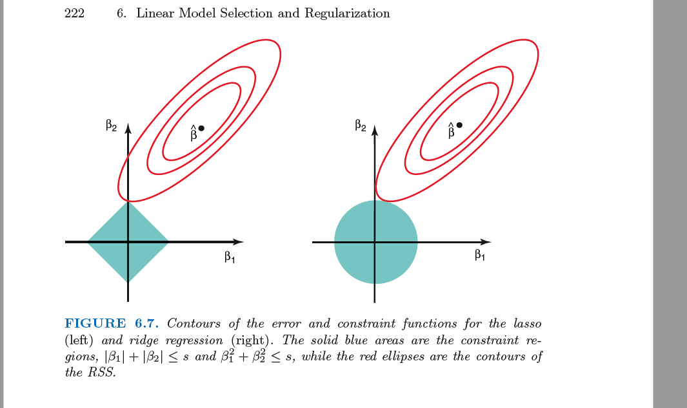

# ML基础

 [03 Learning.pdf](../../W4732 CV II/Slides/03 Learning.pdf)  [lecture11_neural_networks.pdf](../../W4705 NLP/slides/lecture11_neural_networks.pdf) 

## Machine Learning

 [Peter Norvig - Deep Learning and Artificial Intelligence Symposium - YouTube](https://www.youtube.com/watch?v=_wTKhdeAE4U) 

**objective**

teach machine to learn with examples(data): 

​	(1) opens up new possibility that human cannot program - things they learn unconciously

​	(2) speed up

**challenges and pitfalls**

- lack of clear abstraction barriers: hard to debug
- lack of tooling
- nonstationarity(sands of time)
  - data, and the world is changing
- feedback loops
  - developer-user gaming back and force
- safe exploration
  - learn without hurting anybody
- transfer learning
  - model needs the flexibility to apply to somewhere else because can't train everything all the time
- fairness

## Regression Basics

**Model:** $$\hat{y} = f(x;\theta)$$

**Loss function:** $\mathscr{L}(\hat y, y)$

input $x$		

parameter $\theta$

target(labels) $y$ 

**goal:** find $\theta$ that map x to the correct y (i.e.: minimize loss $\mathscr{L}$)

## Models

### Linear (Regression) Models

$$
\begin{align}
\hat{y} & = f(x;\theta) \\
& = \theta^T x	\\
& = \theta_0 x_0 + \theta_1 x_1 + ...
 \end{align}
$$

### **Polynomial Models**

**Linear Models:** 
$$
f(x;\theta) = \theta^Tx = \theta_0x_0 + \theta_1x_1 + ...
$$
**Polynomial Models:**
$$
\begin{align}
f(x;\theta) & = \theta_0x_0 + \theta_1x_1 + \theta_2x_0^2 + \theta_3x_1^2 + \theta_4x_1x_2 + \theta_5 \\
& =\theta^T \phi(x)
 \end{align}
$$
See more at [kernel tricks](ml/kernel_tricks.md).

Nth order polynomial is possible

### Overfitting

**<u>underfit</u>**: high training loss

**<u>overfit</u>**: low training loss , but high **generalization loss**

*we want to find the simplest solution possible*

> **Occam's Razor:** we prefer the simpler hypothesis
>
> eg: 2nd order polynomial >>> 1000th order polynomial

### Regularization

**intuition:** add a term to the objective to encourage a simple solution
$$
\begin{align}
\mathscr{L}(\hat y, y) = & (\hat y - y)^2 + \lambda||\theta||_2^2 \\
												 & \scriptsize   {Data \  Term} \ \ \ \ \  \scriptsize{Regularization}
\end{align}
$$
**regularization**: makes all $\theta$ goes as close to zero as possible, or turn on less $\theta$

#### L1(Lasso) Regularization

用于特征选择：

creating a simpler model that is easier to interpret

#### L2(Ridge) Regularization

保留更多特征（稠密）

will **shrink** the parameters, but will **not** remove any of them. works best when most variables are useful

#### Elastic Net Regularization

- most deep learning models have millions of parameters
  - don't know in advance if the parameters are useful or useless

- **find $\lambda_1$ and $\lambda_2:$** use corss validation on different combinations of $(\lambda_1, \lambda_2)$ 

- pros:
  - gets you both accuracy and sparsity
  - especially good at dealing with correlations between parameters
    - combine lasso's **pick one** of the correlated terms and eliminate others and ridge's **shrinking together all** of the correlated parameters
    - groups and shirnks the parameters associated with the correlated variables and leaves them in equation or remove them all at once

- cons:
  - introducing complexity - a new hyperparameter that could be tricky to tune	

## Loss Function

Squared error:
$$
\mathscr{L}(x, y) = ||x − y||_2^2
$$
Hinge loss:
$$
\mathscr{L}(x, y) = max(0,1-sgn(x\cdot y))
$$
Cosine similarity:
$$
\mathscr{L}(x, y)  = \frac{x^Ty}{||x||||y||}
$$

## Learning

$$
\min_\theta \mathbb{E}_{(x,y)\in\mathscr{D}} \big[ \mathscr L (f(x_i; \theta), y)\big]
$$

- $\mathbb{E}$ - empirical average,  $\sim  \sum $

**motivation:** "What are the parameters that minimize the value of the loss funtion in expectation over the entire dataset?"

### Gradient Descent

1. Make an initial guess for parameters
2. Calculate gradient of loss w.r.t. to the parameters 
3. Step parallel to the gradient

> gradient: direction towards positive growth
>
> => negative gradient: direction towards minima

#### step size/ learning rate: $\alpha$

too small learning rate: Small learning rate: slower progress

too large learning rate: overshoot

#### local vs global solutions

> **convex loss surfaces: ** If the two points are above, then everything in between is also above.
>
> 

- Loss surface are likely not *convex*, so **local minima** occurs.

- solution to local optima: 

  - change loss function

  - try multiple initiations

  - add some noise

- **what actually happens: stop caring...**

#### momentum

- momentum accumulates the history of gradients

​		(1) step faster

​		(2) continue at local minima when normally (see example below)

- $\beta = 0$: same as regular GD

>  
>
> As shown in the plot above, regular GD would stop at the first local minima -- the red point on the left graph;
> With momentum, at the first minimum, $\frac {\delta \mathscr L}{\delta \theta_t} = 0, \ \beta z_t>0$ so $z_{t+1} > 0$. So GD will continue and stop at the green point on the right graph.

## Neural Networks

### History

>  I think some student asked me on the first day, when we're talking about convolutions, and they asked me, why should we bother learning all this because machine learning just neural nets solve all of it for four for you?
>
> I think this is the answer because. You know, you're going to be alive here.... and we might be there, right? And you've got to be able to, you know, still work.

#### xor problem

perceptron(linear models) cannot solve xor problem

#### LeNet

Yann Lecun use convolution to solve 

#### AlexNet

2012: Alex Krizhevsky et al. use relu to reduce ImageNet benchmark over 10%

### Artificial Neural Networks

$$
x_i \in \mathbb R^{D\cross N} \\
W_i \in \mathbb R^{H\cross D} \\
b_i \in \mathbb R^{H} \\
x_{i+1} = \phi(W_i x_i + b_i)
$$

> or more practically:
>
>  

### Activations

> combinations of multiple linear layers = one huge linear layer, same as matrix multiplication:
>
>  $W_1 \cdot W_2 \cdot W_3 \cdot\cdot\cdot = W  $
>
> What makes NN actually works is that some of the layers has to be *nonlinear* (with nonlinear activations).

**Activation** is an element-wise operation that's being applied to each dimension of the of the vectors

- Each output neuron represents one class. Predict the class with the highest activation.

#### sigmoid/logistic

$$
g(z) = \frac{1}{1+e^{-z}}
$$

**cons:** gradient vanishing 

#### tanh

**cons:** gradient vanishing 

#### relu

--"unexplained part of NN"

cons: 

- half of the neurons non-activated
- undefined gradient at 0

solution: 

- ignore it
  - idea: with enough amount of data, (half of the neurons) will still be able to learn with the expectation>0
- leakyRelu

#### leakyRelu

improvement to Relu's eliminates 0 gradient for negative values

in practice works ~same as Relu, so just uset Relu is fine

#### softmax

Normalize activation of each output unit by the sum of all output activations (as in log-linear models).
$$
softmax(z_i) = \frac{\exp(z_i)}{\sum_{j=1}^{k}\exp(z_i)}
$$

- for **multiple class classification**: The network computes a probability $P(z_i|\mathbf x; \mathbf w)$
- **idea**: turns every $x$ positive and sum to $1$ (probability distribution).

- **"soft-max":** soft approximation for max so that it has a gradient

### Batch Normalization

[Ioffe and Szegedy, 2015](https://arxiv.org/pdf/1502.03167.pdf) 

**main point:** training of each network layer is unaffected by changes in scale of the preceding layers.
$$
\begin{align}
x_{i}'&  = a_i \frac{x_i - \mu}{\sigma} + b_i, \\
\mu & = \mathbb E[x_i]\\ \sigma & = Var(x_i)
\end{align}
$$

- $\gamma$ and $\beta$ - scalar values, a pair of each for every BN layer. They are learnt along with the weights using backprop and SGD.
- BN layer can be before/after activation
- **Intuition**: build some second-order information into the network by normalizing the variables before the activation functions
- ==moving average== 

> [why scale and shift after normalization?](https://stats.stackexchange.com/questions/272010/batch-normalization-shift-scale-parameters-defeat-the-point) **avoid zero proximity.**
>
> Parameters $\gamma$ and $\beta$ are a must have, because otherwise the normalized outputs $x_i$ would be mostly close to $0$, which would hinder the network ability to fully utilize nonlinear transformations (authors give an example of sigmoid function, which is close to identity transformation in $0$ proximity)
>
> [why introduce new parametrization($\gamma$ and $\beta$ ) instead of using network weights(W and b)?](https://stats.stackexchange.com/questions/310326/why-does-batch-norm-have-learnable-scale-and-shift/310761#310761)
>
> The answer is that the new parametrization can represent the same family of functions of the input as the old parametrization, but the new parametrization has different learning dynamics. **In the old parametrization, the mean of H was determined by a complicated interaction between the parameters in the layers below H. In the new parametrization, the mean of γH+β is determined solely by β. The new parametrization is much easier to learn with gradient descent.**

### Dropout

$$
x_{i+1}^j = 
\begin{cases} 
x_{i+1}^j & \ \text{with probability } p \\
0 & \ \text{otherwise}
\end{cases}
$$

- with (1-p) probability it puts 0, otherwise propagates ahead.

- **for robustness:** in learning, if some feature were disappeared, the model still be able to work.

### Width vs Depth

wide: how big $W_i$ dimensionality is

deep: how many $W_i$ 

- theoretically you don't need a deep network
- in practice: massive matrix multiplication is computational expensive, deeper network stacks fast computational speeds

**Universal approximation theorem**: with **sufficiently wide** network and just one layer, you can appoximate any continuous function with arbitrary approximation error.

### Back Propagation

- use **chain rule** to pattern match the chained gradient equation

- **"caching" mechanism: **

  - compute in reverse order and store

  - front gradients can reuse the already-calculated gradients from the back

- **parallel branch:** send same copy of gradient back, like parent sent to two children

> **Caveats:**
>
> We don't always need to calculate the loss L, we only need to calculate the **gradients**. 
>
> There are some models where it's intractable to actually compute the lost function, but is tractable the gradient of it.

## Reference

[TensorFlow, Keras and deep learning, without a PhD](https://codelabs.developers.google.com/codelabs/cloud-tensorflow-mnist#3)  

[Tensorflow and deep learning - without a PhD - Google Slides](https://docs.google.com/presentation/d/1TVixw6ItiZ8igjp6U17tcgoFrLSaHWQmMOwjlgQY9co/edit#slide=id.g140797b42d_0_60) 

[Batch Norm Explained Visually — How it works, and why neural networks need it | by Ketan Doshi | Towards Data Science](https://towardsdatascience.com/batch-norm-explained-visually-how-it-works-and-why-neural-networks-need-it-b18919692739)  

[machine learning - Batch Normalization shift/scale parameters defeat the point - Cross Validated](https://stats.stackexchange.com/questions/272010/batch-normalization-shift-scale-parameters-defeat-the-point) 

[Why does batch norm have learnable scale and shift? - Cross Validated](https://stats.stackexchange.com/questions/310326/why-does-batch-norm-have-learnable-scale-and-shift/310761#310761) 

[machine learning - Batch normalization instead of input normalization - Stack Overflow](https://stackoverflow.com/questions/46771939/batch-normalization-instead-of-input-normalization) 

[A Gentle Introduction to Batch Normalization for Deep Neural Networks](https://machinelearningmastery.com/batch-normalization-for-training-of-deep-neural-networks/) 

[Moving average in Batch Normalization - github](https://jiafulow.github.io/blog/2021/01/29/moving-average-in-batch-normalization/#:~:text=Hence%2C%20the%20moving%20average%20will,a%20faster-changing%20moving%20average.) 

[Efficient BackProp](http://yann.lecun.com/exdb/publis/pdf/lecun-98b.pdf) by Yann LeCun, Leon Bottou, Genevieve B. Orr, and Klaus-Robert Mülleri. (2012)

