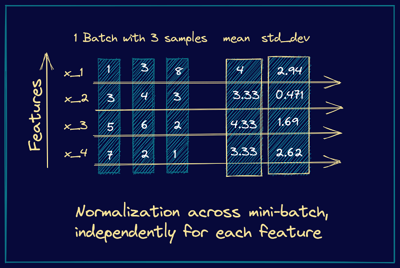
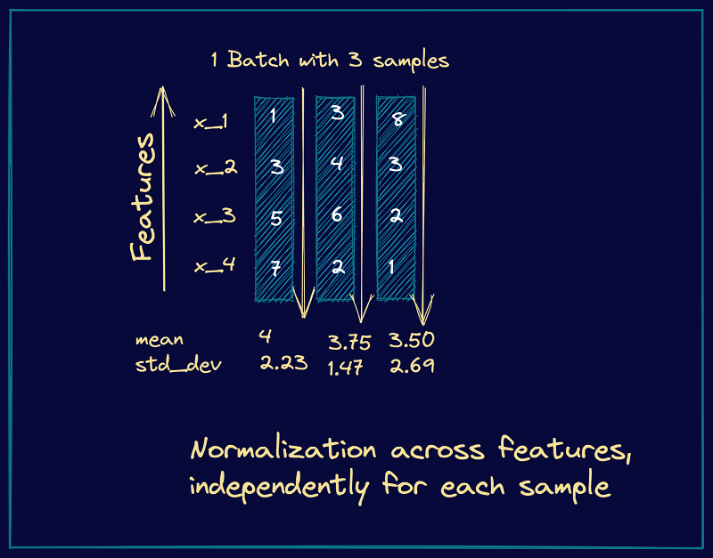

## Batch Normalization

batch-wise per feature, across samples

- 对于小batch size无效

- 训练和预测阶段步骤不同

  - 训练：维护mean和variance的moving average [Moving average in Batch Normalization](https://jiafulow.github.io/blog/2021/01/29/moving-average-in-batch-normalization/) 
  - 预测：使用存储的runing mean & variance 

  > 需要用moving average的原因：在训练中会穿插验证（使用验证集数据进行预测），这时全部batch的训练还没有结束，因此可以使用runing mean & variance进行预测。

## Layer Normalization

layer-wise per sample, across features

- 训练与预测阶段相同