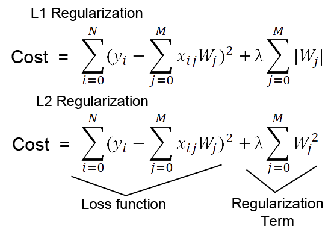
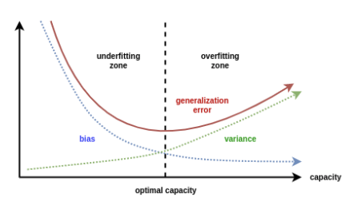

# Regularization（正则化）

 [Regularization Techniques in Machine Learning](https://www.analyticsvidhya.com/blog/2021/05/complete-guide-to-regularization-techniques-in-machine-learning/) 

## overfitting

generalization error 泛化误差

## regularization, in general

- <u>regularization</u>: a form of regression that shrinks the coefficient estimates towards zero.
  - forces us not to learn a more complex model

- adding a **penalty term** with Residual Sum of Squares (RSS)

- λ -  tuning parameter used in regularization that decides how much we want to penalize the flexibility of our model

## Ridge & Lasso Regression

### ridge regression

RSS + total sum of **squares** of coefficients

use:

- high collinearity
- parameters > samples

limitation

- not for feature selection
- model interpretability (dense, all features have >0 but small value)

### lasso regression

RSS + total sum of **absolute** of coefficients

use:

- automatic feature selection (absolute 0)

limitation:

- not useful for parameters > samples 

  (pick at most n predictors as non-zero, even if all are relevant)

- not useful for multicolinearity: (select one of them randomly)

### constraints region

将L1和L2正则化转换成约束函数限制下的等式求解：

define constraint function:

$$
\beta_1^2 + \beta_2^2 \leq s \\ and  \\

|\beta_1| + |\beta_2| \leq s
$$

Here, s is a constant which exists for each value of the shrinkage factor λ.

green area - constraint function

red ellipse - contours for RSS

ridge: circular constraint region have no sharp points, so intersection generally occur on the axes

lasso: diamon constraint region with corners, often intersect at axes(one of the coefficients will be 0)

### bias-variance tradeoff

underfitting - high bias, low variance

overfitting - low bias, high variance

regularization aims to find the optimal capacity with **low variance and relatively low bias**, between underfitting and overfitting.