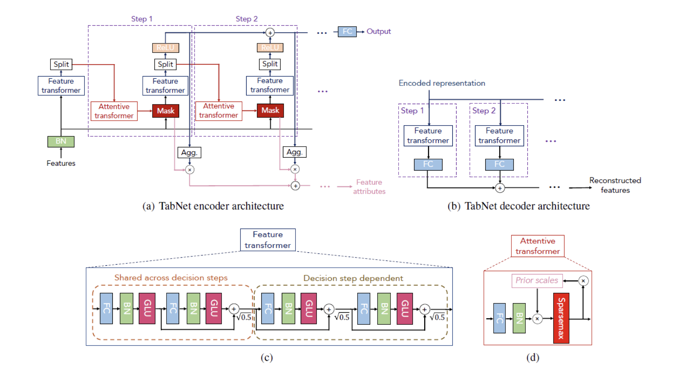
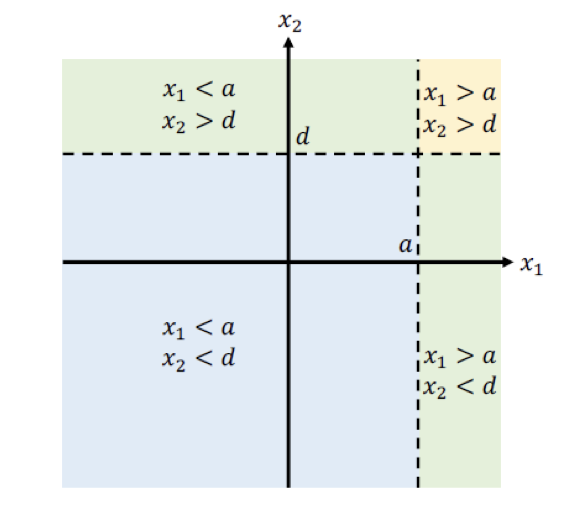
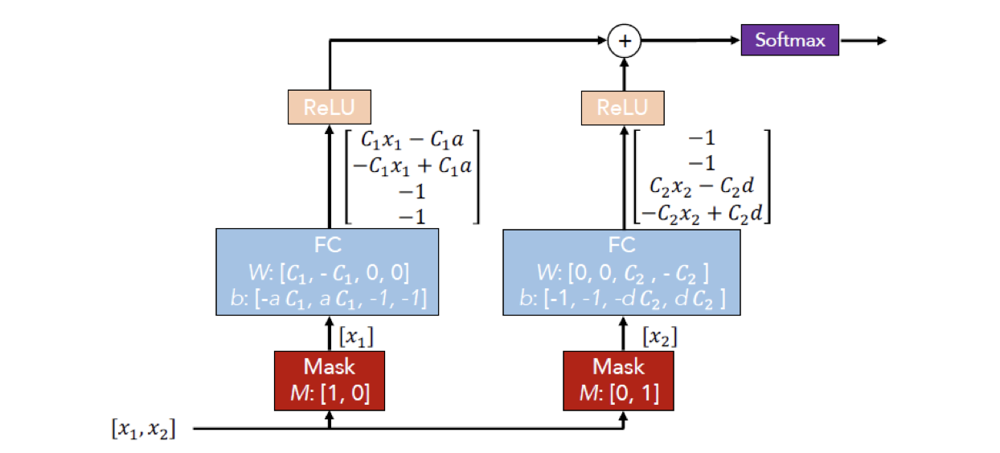
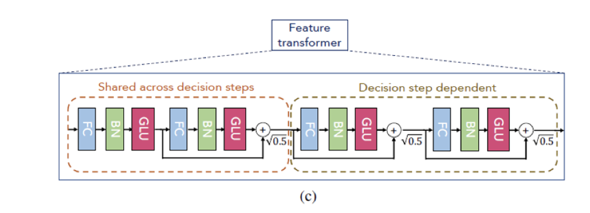
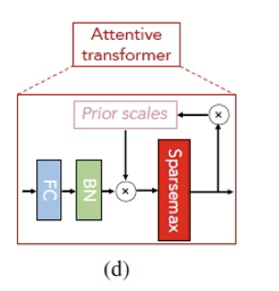
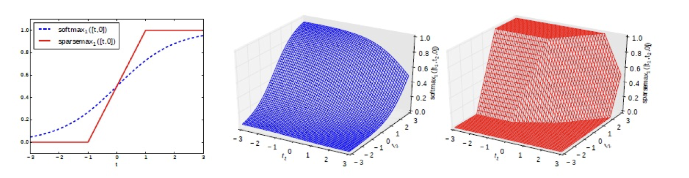
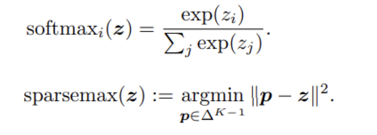

# Tabnet

 [TabNet: Attentive Interpretable Tabular Learning](https://www.aaai.org/AAAI21Papers/AAAI-1063.ArikS.pdf)  [tabnet.pptx](tabnet.assets/tabnet.pptx)  

## 参考

 [数据挖掘竞赛利器——TabNet模型浅析 - 知乎](https://zhuanlan.zhihu.com/p/152211918) 

 [Tabnet 完全指南 - 知乎](https://zhuanlan.zhihu.com/p/357911274)

 [TabNet - GeeksforGeeks](https://www.geeksforgeeks.org/tabnet/)  

 [TabNet: The End of Gradient Boosting? - by Adam Shafi - Towards Data Science](https://towardsdatascience.com/tabnet-e1b979907694) 

 [Talks # 4: Sebastien Fischman - Pytorch-TabNet: Beating XGBoost on Tabular Data Using Deep Learning - YouTube](https://www.youtube.com/watch?v=ysBaZO8YmX8) 

## Architecture

### From Decision Tree to NN

 

使用神经网络模仿决策树机制 - 

决策树：特征选择 + 条件（阈值）判断

NN: 

- mask-特征选择

- FC+Relu：条件判断：通过选择特定的W和b，每条路径的输出向量中只有一个值是正，剩下的都为负（过Relu之后为0），这就很好的模仿了决策树向下走的过程。

### Feature Transformer

2层共享特征步+2层独立特征步：

- 共享特征：提升效率，因为输入的特征相同
- 独立特征：差异性

决策树：硬决策，输出结果（只能选一个点）

FT（+softmax）：软决策，输出概率

#### GLU

 [GLU: Gated Linear Unit implementation - by Alvaro Durán Tovar - Deep Learning made easy - Medium](https://medium.com/deeplearningmadeeasy/glu-gated-linear-unit-21e71cd52081)  

[Language Modeling with Gated Convolutional Networks](https://arxiv.org/pdf/1612.08083.pdf) 
$$
h_l(\mathbf X) = (\mathbf X * \mathbf W + \mathbf b) \otimes \sigma(\mathbf X*\mathbf V+\mathbf c)
$$

- 比ReLu稳定（小心Dead ReLu)
- 比sigmoid损失降得快
- gated结构参考LSTM gates:
  - gradient计算可以类比resNet：转换成两个gradient的加性计算，可能更好

### Attention Transformer

$M[i] = h_i(a[i-1] \cdot P[i-1])$

$P[i-1] = \prod_j (\gamma - M[j])$

M - attention权重

P- Prior scales项：向后传递，控制feature在之前的step中的运用程度

Sparsemax - 增强稀疏性，滤除噪声

#### Sparsemax激活函数

### Sequential Steps

## Pre-trained

