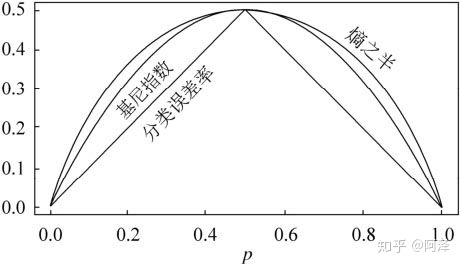
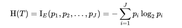
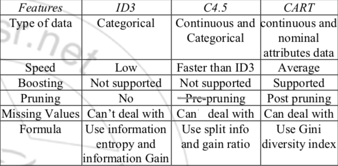

# Decision Trees

 [MIT 6.034 Artificial Intelligence](https://www.youtube.com/watch?v=SXBG3RGr_Rc) 

 [Decision and Classification Trees, Clearly Explained!!! - YouTube](https://www.youtube.com/watch?v=_L39rN6gz7Y&t=3s) 

## Measures

[Study of The ID3 and C4.5 Learning Algorithms | Open Access Pub](https://openaccesspub.org/jmid/article/1334)  

[决策树--ID3、C4.5、CART](https://zhuanlan.zhihu.com/p/85731206) 

## Impurity Measure

#### entropy

衡量集合内部**混乱程度**，high entropy = high **disorder**

see [entropy](losses.md)

$$
Entropy = - \sum _{x \in X} p(x) \log p(x)
$$

#### gini index

Gini index measures the **divergence between the distributions of the target attribute’s values and the “classification error”:**

基尼指数反映了从**数据集中随机抽取两个样本，其类别标记不一致的概率**。
$$
Gini = 1 - \sum_i p_i^2 \\
Gini \ Index = \sum \frac{|D_i|}{|D|}Gini(D_i)
$$

- Gini在这里和信息量logp(x)的作用差不多，而使用Gini Index需要算Gini的**期望值**，即所有分类下的Gini的加权和。

#### Gini and Entropy

我们可以看到在平方运算和二分类的情况下，其运算更加简单。当然其性能也与熵模型非常接近。

我们知道 $ln(x)=−1+x+o(x)$ ，所以
$$
H(X)=−\sum_{k=1}^K p_k \ln ⁡p_k≈−\sum_{k=1}^K p_k(1−p_k)
$$
可以看到，基尼指数可以理解为熵模型的一阶泰勒展开。

### Information Gain

###### IG measures the the **discriminative power** of an attribute: 

> among all attributes which characterize a set of records or objects, the attribute that return enormous information about these records. In other words, the attribute that return the lowest impurity.

**goal of building tree:** reduce impurity

> discover the attribute that partitions the parent node of objects or records into sub-sets, with the following constraint, each sub-set must be the **purest** set possible. Means that the sub-set must has a **low impurity value**.

$$
IG = I(Parent) - \sum_j \frac{N(v_j)}{N} I(v_j)
$$

## 决策树算法

recursively,

tree growing: run through search space, select attribute test condition to split 

attribute test condition: calculate IG for each attribute

stop condition: 

leaf is pure(all same class label)

all nodes  identical attribute values

### ID3

采用entropy计算增益

贪心地，每次在候选attributes里选择信息增益最大的进行分裂。

局限：

- 不能处理连续型特征
  - 会和类别型特征一样，每个数值分成一个节点：
  - impurity=0，IG(parent) = I(parent)
  - 效率低，泛化性能差

### C4.5

同一个作者对ID3的优化：

- 离散特征：处理方法与ID3相同

- **连续特征**：提出了两种处理方法：

1. 使用gain ratio（改进IG）

$$
Gain \ Ratio = \frac{IG}{split \ info} \\
   
   split \ info = - \sum_{i=1}^c p(v_i) \log p(v_i)
$$

split info：分裂的熵（label = 每个分支值）作为分裂的惩罚项

分支数越多，split info越大，Gain Ratio越小

2. 每个数值作为阈值，分为<=和>两类；遍历所有可能的阈值，选择作为阈值增益的IG作为该特征的IG，再和其他attribute的IG比较。

优势：

- 支持连续型特征
- 支持训练数据的缺失值处理(inputation)
  - distribution-based inputation
    - 根据分布决定数据**插补**权重
- post-pruning剪枝：
  - **悲观剪枝算法**
  - 通过训练数据集上的错误分类数量来估算未知样本上的错误率）

### CART

#### 采用**gini指数**计算增益

Gini系数可以看做熵的一阶泰勒估计，减少大量的对数运算。

参见[gini系数](# gini-index).

#### 回归树

支持回归类预测任务（预测目标可以是连续型）

- impurity measure使用和方差(SSR)
- 预测：取最终叶子的均值或者中位数
  - xgboost基于CART但使用*模型树* - 用函数估计最终值

#### 类别不均衡问题

针对类别不均衡的分类任务：先验机制

- 对于一个二分类问题，节点 node 被分成类别 1 当且仅当：

$$
\frac{N_1(node)}{N_1(root) } > \frac{N_0(node)}{N_0(root)}
$$

> 比如二分类，根节点属于 1 类和 0 类的分别有 20 和 80 个。在子节点上有 30 个样本，其中属于 1 类和 0 类的分别是 10 和 20 个。如果 10/20>20/80，该节点就属于 1 类.
>
> 通过这种计算方式就无需管理数据真实的类别分布。假设有 K 个目标类别，就可以确保根节点中每个类别的概率都是 1/K。这种默认的模式被称为“先验相等”。

#### 代价复杂度剪枝

[How to Prune Regression Trees, Clearly Explained!!! - YouTube](https://www.youtube.com/watch?v=D0efHEJsfHo) 

CART采用一种叫做基于代价复杂度(Cost-complexity pruning)的剪枝方法，aka **weakest link pruning**
$$
Tree \ score = C(T) + \alpha T
$$
$C(T)$- SSR or Gini Index

$\alpha$ - control leave penalty, find by **cross validation**

**steps:**

1. with **full dataset**: build full tree and then "prune" one node at a time, calculate the 

   **threshold for $\alpha$ ** that make total tree score new pruned tree lower than previous 

2. split train+test set randomly

3. using **train dataset**: for each $\alpha$, build a tree that **minimize tree score**

4. using **test dataset**: calculate **SSR** for each tree

5. repeat step 2-4 10x, choose the $\alpha$ that **minimize average SSR over the 10 experiments**

#### 缺失值处理

vs C4.5: CART 采用代理测试来估计缺失值，而 C4.5 以不同概率划分到不同节点中

>  上文说到，模型对于缺失值的处理会分为两个子问题：
>
> 1. 如何在特征值缺失的情况下进行划分特征的选择？
> 2. 选定该划分特征，模型对于缺失该特征值的样本该进行怎样处理？
>
> 对于问题 1，CART 一开始严格要求分裂特征评估时只能使用在该特征上没有缺失值的那部分数据，在后续版本中，CART 算法使用了一种惩罚机制来抑制提升值，从而反映出缺失值的影响（例如，如果一个特征在节点的 20% 的记录是缺失的，那么这个特征就会减少 20% 或者其他数值）。
>
> 对于问题 2，CART 算法的机制是为树的每个节点都找到代理分裂器，无论在训练数据上得到的树是否有缺失值都会这样做。在代理分裂器中，特征的分值必须超过默认规则的性能才有资格作为代理（即代理就是代替缺失值特征作为划分特征的特征），当 CART 树中遇到缺失值时，这个实例划分到左边还是右边是决定于其排名最高的代理，如果这个代理的值也缺失了，那么就使用排名第二的代理，以此类推，如果所有代理值都缺失，那么默认规则就是把样本划分到较大的那个子节点。代理分裂器可以确保无缺失训练数据上得到的树可以用来处理包含确实值的新数据。

#### 优势

- 二叉树效率高
- 可以用于回归
- Gini系数减少运算
- 使用代理测试方法缺失值估计

### 对比

