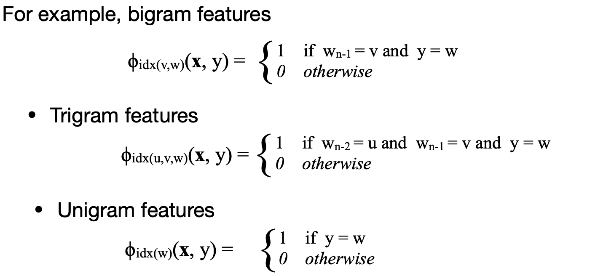
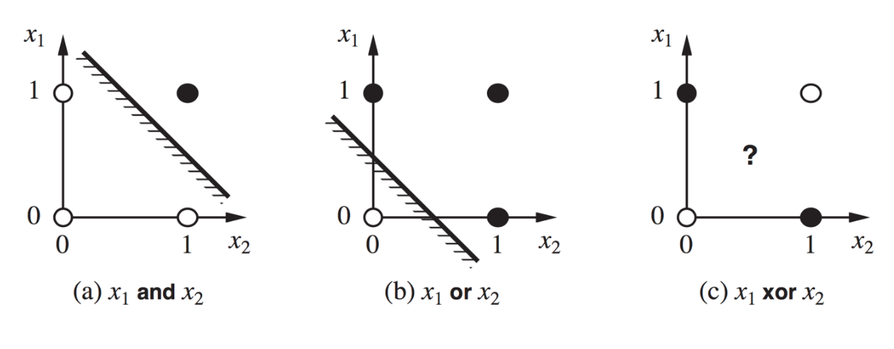
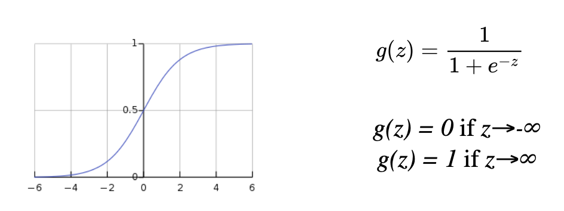

# Machine Learning and NLP

 [lecture10_linear_loglinear_models.pdf](../slides/lecture10_linear_loglinear_models.pdf) 

- tasks:

  - text classification

  - language modeling: predict the next word

  - POS tagging: predict the POS 
  - constituency/dependency parsing

## Algorithm

### Generative Algorithm

- assume the observed data is “generated” by a “hidden” class label

- a model for each class

- model $P(x\vert y)$ and $P(y)$, then use Bayes’ rule:
  $$
  P(y\vert x) = \frac{P(x\vert y)P(y)}{P(x)}
  $$

### Discriminative Algorithm

- model conditional distribution of the label give nthe data $P(y\vert x)$ 

- train: learn **decision boundaries**
- predict: see which side of decision boundary it falls

## Learning

### Inductive Learning

- **goal**: given x/y pairs (training data), find f(x): x->y
- **problem**: we did not see all possible inputs
- **strategy:** learn an apporx. function h(x) for the training data and hope this function generalizes
- **Ockham’s razor:** choose the simplest hypothesis that is consistent with the training data

### Classification

 predict a label from a set of labels.

learn a classifier function:
$$
h: \R^d \to \{+1, -1\}
$$

### Regression

predict a numeric function.

learn a regressor function:
$$
h: \R^d \to \R
$$

## Training

#### error/risk function

(confidence on the learned function:)

compute **empirical** error/risk on the training set
$$
E_{train}(h) = \sum_{i=1}^{m} loss(y_i,h(x_i))
$$

- training aims to minimize $E_{train}$
- We hope that minimizing training error also minimizes , the test error.

#### loss function

least square loss: $loss(y_i,h(x_i)) = (y_i - h(x_i))^2$

classificaltion error: $loss(y_i,h(x_i)) = 1 \ \text{if} \ sign(h(x_i)) \ne sign(y_i)$

#### overfitting

works well in training data, but does not generalize to the testing data

- overfitting can model the **noise** in the data

- ##### prevent overfitting:

  - feature selection

  - model selection

  - regularization

  - cross validation

  * *adding wrong assumptions(**bias**) can lead to underfitting**

**Structural Risk Minimization**

-  minimize $E_{train} + \beta H(W)$,   $H(W) - \text{regularization function }$ 

## Linear Models

$$
f(x_i) = sign(\sum_{j=0}^{d} w_jx_{ij})
$$

$$
\begin{pmatrix}
x_0\\
...\\
x_d
\end{pmatrix}
\dotproduct
\begin{pmatrix}
w_0\\
...\\
w_d
\end{pmatrix}
=\sum_{j=0}^{d}x_{j} w_j
$$

- model specified by parameter **w**
- estimate **w** on the basis of the trianing set
- minimize loss: classification error

### Perceptron learning

**problem**: threshold function not differentiable, so cannot find closed-form solution or GD

**update rule:**
$$
w_j \leftarrow w_j + (y-h_w(x)) * x_j
$$
**idea:**

- amplify or de-amplify the prediction

- shift the weight in a direction proportionate to the feature vector x

***“always work”:***

>  **Perceptron Convergence Theorem**: any linear function can be learned using this algorithm in a finite number of iterations.

### Feature Functions

$$
\phi (x,y) : \mathcal{X} \cross \mathcal{Y} \to \R^d
$$

*x* - input object 

y - possible output.

#### Multiclass Perceptron

- Apply the linear model to for each *y.*

- predict the one with highest score:
  $$
  \arg\max_{y \in Y} \sum_{j=1}^{d} w_{j} · \phi_j (x,y)
  $$
  

> Features Example
>
> 

## Log-Linear Model

==**(Maximum Entropy Model)**==

 [loglinear.pdf](../slides/loglinear.pdf) 

- define conditional probability $P(y\vert x)$:
  $$
  P(y\vert x;\textbf w) = \frac{\exp(\textbf w·\phi(x,y))}{\sum_{y' \in Y}\exp(\textbf w·\phi(x,y))}
  $$
  

### Log-Likelihood

$$
LL(\textbf w) = \sum_{}^{} \log P(y_i\vert x_i;w) \\
LL^*(\textbf w) = \arg \max_{\textbf w} \sum_{}^{} \log P(y_i\vert x_i;\textbf w)
$$

#### Gradient-base optimization (Gradient Ascent)

$$
w_j' \leftarrow w_j + \alpha \frac{\partial}{\partial w_j}LL(\textbf{w})
$$

==Partial derivative of the log likelihood==

### Regularization

problem: overfitting

##### L2 regularizer: 

$$
LL(w) = \sum_{}^{} \log P(y_i\vert x_i;\textbf w) - \frac{\lambda}{2} \vert \vert \textbf{w}\vert \vert ^2\\
=\sum_{}^{} \log P(y_i\vert x_i;\textbf w) - \frac{\lambda}{2} \sum_{j=1}^{d} w_j^2
$$

## POS Tagging with Log-Linear Model

we want to use a discriminative model for $P(t_1, ... t_n \vert  w_1, ..., w_m) $

### MEMMs

independence assumption:
$$
\begin{align}
& P(t_1, ... t_n \vert  w_1, ..., w_m) 
\\ = &  \prod _{i=1} ^{m} P(t_1\vert  t_1, ..., t_{i-1}, t_{i+1}, ... t_n, w_1, ..., w_m)
 \\= &  \prod _{i=1} ^{m} P(t_1\vert  t_{i-1}, w_1, ..., w_m)
 \end{align}
$$
model each term using a log-linear model

**training**: same as log-linear model

**decoding**: need to find $\arg\max_{t_1...t_m} P(t_1...t_m\vert w_1...w_m) = \arg\max P(t_1...t_m,w_1...w_m) $

#### ==Maxent Tagger Feature Function==

$\phi(w_1, ..., w_m, i, t_{i-1}, t_i)$ a feature vector of length d.


- templates

  - (t_i-1, ti)

  - (prefix1 of wi,ti), (prefix2 of wi,ti), (prefix3 of wi,ti), (prefix4 of wi,ti)

  - (wi contains numbers, ti), 

    (wi contains uppercase characters, ti)
 

    **(wi  contains a hyphen, ti)**

- 
instantiated features

  - ...

# Neural Networks

 [lecture11_neural_networks.pdf](../slides/lecture11_neural_networks.pdf) 

## Limitation of Linear Models

> some function (eg: xor function) cannot be learned

## Multi-Layer Neural Networks

**Basic idea:** represent any (non-linear) function as a composition of soft-threshold functions. This is a form of *non-linear* regression.

**Universal approximation theorem**: with sufficiently wide network and just one layer, you can appoximate any *continuous* function with arbitrary approximation error.

**Lippmann 1987**: Two hidden layers suffice to represent any arbitrary region (provided enough neurons), even *discontinuous functions*!

### Activation Function

- step function is undifferentialble
- Each output neuron represents one class. Predict the class with the highest activation.

#### sigmoid(logistic)

$$
g(z) = \frac{1}{1+e^{-z}}
$$

#### tanh

#### relu

#### softmax

Normalize activation of each output unit by the sum of all output activations (as in log-linear models).
$$
softmax(z_i) = \frac{\exp(z_i)}{\sum_{j=1}^{k}\exp(z_i)}
$$

The network computes a probability $P(c_i\vert \mathbf x; \mathbf w)$

### Computation Graphs

can build computation graphs for neural networks:

### Backpropagation

#### Learning in Neural Networks

Network architecture is *fixed*, but weights are *trainable*.

**feed-forward** neural networks: no connections that are loops

#### BP algorithm

#### Negative Log-Likelihood

(cross entropy loss)

#### (Stochastic) Gradient Descent

*(for a single unit):*

**goal**: learn parameters that minimize the empirical error

**batch gradient descent/mini-batch gradient descent**: 

It often makes sense to compute the gradient over batches of examples, instead of just one (**"mini-batch**").

**Chain rule of Calculus:**
$$
\text{The derivative of}\ f(g(x)) \ \text{is}: \ \frac{df(g(x))}{dx} = \frac{df(g(x))}{dg(x)} \dotproduct \frac{dg(x)}{dx}
$$

> BP Example:
>
> >  computation partial gradients:
>
> 
>
> >  back propagation:
>
> 

#### BP with multiple neurons

Once the $\Delta_j$  have been computed, we can compute the
 gradients w.r.t to the weights.

