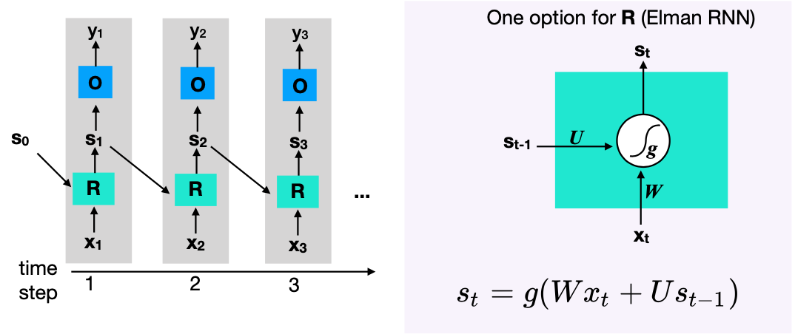

# WordNet, continued

 [lecture13_wordnet_wsd.pdf](../slides/lecture13_wordnet_wsd.pdf) 

## Word Sense Disambiguation(WSD)

Given a word token in context, identify its correct word sense (from a list of possible word-senses).

### **Senses**

What set of *senses*:

- MT: possible translations of a word

- Speech Synthesis: 

  > Homographs (bass, lead)

- Senses from a dictionary like a WordNet

### Types of Tasks

- lexical sample task

- all-words task: each word in an entire text

### method

- supervised ML
  - train a classifier for each word
  - requires hand-labeled training data(sense annotations)
- dictionary methods
  - no traing data, instead use a sense dictionary like WordNET
- semi-supervised learning
  - use a small hand-annotated data set and generalized(“==bootstrapping==”)
    - textbook

### Feature Definition(for ML methods)

#### Bag-of-Words features

> *He learned how to play* *<u>guitar</u> <u>and</u>* **bass** *watching <u>Youtube</u>* *<u>videos</u>.*

#### Collocational Features

Position specific information about the words in the window

> *He learned how to play* *<u>guitar</u> <u>and</u>* **bass** *watching <u>Youtube</u>* *<u>videos</u>.*
>
> [guitar, NN, and, CC, watching, VBG, Youtube, NNP]
>
> [wordn-2, POSn-2, wordn-1, POSn-1, wordn+1, POSn+1]

tends to work better for WSD

### Dictionary-Based Method

Instead of annoted training data for ML methods, we can use a separate dictionary, such as WordNet:

- to obtain candidate senses.
- to obtain information that allows us to identify which of the candidate senses is correct.

#### Simplified Lesk Algorithm

*(Lesk 1986)*

- Use dictionary glosses for each sense.
- Choose the sense that has the highest word overlap between gloss and context (ignore function words).

#### Extensions to Lesk Algorithm

- often overlap is 0
- approach: extending definitions (#31)
  - corpus-lesk
  - extended gloss overlap

### WSD Performance

SemEval 2015 (all-words task)

- Supervised Neural Network approaches 
 (e.g. based on BERT) ~80%

- Dictionary based approaches ~72%

- Human annotator baseline (inter-annotator agreement): 75%-80%

### Lexical Substitution Task

Instead of identifying word sense

- find a substitute for the target word, such that the meaning is perserved	
- idea: use WSD first

----

# RNN

 [lecture14_rnn_elmo.pdf](/Users/yijiajin/Desktop/W4705 NLP/slides/lecture14_rnn_elmo.pdf) 

## Sequence Modeling

- Many NLP tasks require models of sequences (language models, text classification, sentiment analysis, POS tagging, machine translation)
- Neural Language Model:
  - represent the *context* as a sliding window
  - Input word-representations for context words are concatenated.
  - Shared weights across contexts.
- Recurrent Neural Networks take **entire** history into account.

## Basic RNN

**basic idea:** 

Hidden layer represents a state. 


State representation is fed back into the function R.

 

**note:** Weights are shared across all time steps: 

- i.e. $R$ doesn’t change, only $s_i$ (input) changes

RNN computes a function $y_i = \text{RNN}(x_1, ..., x_i)$

The output at step i depends on all previous steps.

### Vanishing Gradient

solution:

#### LSTM

- A popular option for the function **R

- Split state vector into two halfs: "memory cell" **c** and working memory **h**. 

- "gates" decide:
  - how much of the input to add to the memory 
  - how much of current memory to forget

**f**: forget gate - erase memory cell?

**i**: input gate - write input to memory cell?

**g:** (?) gate - how much input to write to 
 memory cell.

**o:** output gate - how much of the cell
 should be used for the output.

## ==Common Usage Patterns==

### Acceptor

**Applications**: Text classification, sentiment detection, ...

#### Encoder

use RNN to compute sequence encoding

this encoding representation is then used in some other task

### Transducer

One output for each input (time step).

During training, loss for each time step is combined.

**applications**: language modeling, sequence tagging (e.g. POS)

#### RNN Language Model

Using RNNs, we can get rid of the the Markov assumption and 
directly compute $P(w_i\vert w_1, ..., w_{i-1})$

#### Generator

transducer used for generator:

**applications**: language generation, MT

#### Conditioned Generator

other context + generator

takes in other context as additional input, such as an image encoder(CNN)

**application**: image captioning

#### Encoder-Decoder

encoder +  generator

takes another encoder as other context

**application**: machine translation

## Variations in Architectures

### Bi-directional RNN(biRNN)

**idea**: might be helpful to look from both sides, instead of left input context only.

### Stacked/Deep RNNs

## Unsupervised Pre-Training

- annotated training data is sparse and expensive to create

- **idea**:train a model on some unsupervised task on large amounts of data, then **transfer** the model parameters to another task.
- in NLP:
  -  transfer the component that computes dense representations of text (words or sentences).
- Pre-trained model parameters may be **fine-tuned** on specific supervised tasks.

### ==ELMo==

$$
\sum_{}^{}(\log p(t_k\vert t_1,...,t_{k-1}; \Theta_x, \overrightarrow \Theta_{LSTM}, \Theta_s) \\ 
+ \log p(t_k\vert t_{k+1},...,t_{N}; \Theta_x, \overleftarrow \Theta_{LSTM}, \Theta_s))
$$

“==replace==”, doing just about the same

# Attention Mechanism

[lecture15_attention_transformers (1).pdf](../slides/lecture15_attention_transformers (1).pdf) 

## Seq2Seq

## Problems with RNNs for MT

- fixed length encoded representation becomes information bottoleneck
- not everything is equally important
- the idea of “alignment” in statistical MT
  - Each output word corresponds to one (or a few) words in the input.
  - long distance dependencies between input and output.

## Attention Mechanism

### Conditioned Generation with Attention

context vector is specialized per $y_j$

### Obtain alignment weights

- compute $score(s_{j-1}, h_i)$ :

- compute alignment weights

  $$\alpha_{j,i} = \text{softmax}[\text{score} (s_{j-1}, 1), ..., \text{score}(s_{j-1}, N)] $$

### Attention as Lookup

visualize $\alpha_{j,i}$: 

