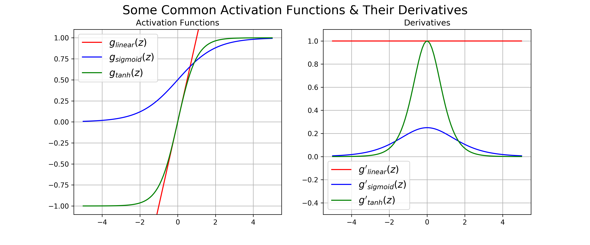

# RNN

 [The Unreasonable Effectiveness of Recurrent Neural Networks](http://karpathy.github.io/2015/05/21/rnn-effectiveness/) 

A recurrent neural network can be thought of as **multiple copies of the *same* network**, each passing a *different* message to a successor.

- 对于只需利用近距离信息的短期记忆任务有效

问题：

- 只有短期记忆：梯度**被近期距离主导**，导致模型很难学习到远距离的依赖关系。
- 梯度消失/梯度爆炸

## RNN训练

#### BPTT(Backprop through time)

反向传播过程中将RNN展开(不记忆之前的模型权重，因此权重参数全部都是一样的），梯度从最近的计算步骤反向传播至之前的计算步骤，再依次传到上一时间步的所有计算步骤...

## 梯度消失/爆炸问题

*During the backpropagation in the deep neural networks, the Vanishing gradient problem **occurs due to the sigmoid and tan activation function** and the exploding gradient problem **occurs due to large weights.***

”一锅老鼠屎“：BP是链式法则（梯度相乘）。只要一个乘数出问题就会坏事：

- 梯度消失的问题出在**sigmoid/tanh activation**

- 梯度爆炸的问题出在**权重参数过大**

### 原因

1. 展开的RNN通常非常非常深

2. RNN包含许多相同的梯度项:

   > non-recurrent：
   >
   > $w_1·\alpha_1·𝑤_2·\alpha_2···𝑤_𝑑·\alpha_𝑑$
   >
   > RNN：
   >
   > $w·\alpha_1·𝑤·\alpha_2···𝑤·\alpha_𝑑$

### 策略

#### 其他激活函数（relu）

#### Batch Normalization

sigmoid、tanh这类激活函数出现梯度消失的根本原因是数值过大(>=5)，标准化数据可以把大部分的数据范围限定在[-4,4]之间，因此可以很大程度缓解梯度消失问题。

#### Residual Connections

#### Truncated BPTT

#### gradient clipping

# LSTM

- 解决RNN不擅长长期记忆的问题，**改善**梯度消失问题。

- *原始的paper里没有forget gate(f_t=1)*

The repeating module in a standard RNN contains **a single layer**.

The repeating module in an LSTM contains ***four* interacting layers**.

## 结构

### cell state(细胞状态)

acts as a transport highway that transfers relative information all the way down to the sequence chain

**(think of this as the *memory* of the network)**

### hidden state

short-term memory (上一个时间步输出)

**cell state: 长期**

**hidden state：短期**

### gates

每个gate的组成：

- **sigmoid NN**：决定留多少(output [0,1] *for each number* in ...)
- **element-wise multiplication**: 用于element-wise控制信号流通，0-不通过，1-全部通过

#### forget gate

#### input gate 

#### combining f+i

#### outputgate

### activations

- 激活用于预测的输入相关的用tanh
  - ==原因？==

- 激活控制门系数用sigmoid
  - 原因：值域[0,1]

### 关于LSTM改善梯度消失问题 

[How LSTM networks solve the problem of vanishing gradients - by Nir Arbel - DataDrivenInvestor](https://medium.datadriveninvestor.com/how-do-lstm-networks-solve-the-problem-of-vanishing-gradients-a6784971a577) 

原理：

- **the gradient contains the forget gate’s vector of activations, which allows the network to better control the gradients values, at each time step, using suitable parameter updates of the forget gate：** 遗忘门$c_t = c_{t-1} * f_t + \tilde c_t * i_t$ 可以控制cell state保留远距离的梯度，相当于在cell state这条“高速公路“上的梯度不会消失，这里类似于一个残差连接的作用。
- **cell state gradient is an additive function：**cell state的梯度是加性模型，消失梯度+正常梯度=正常梯度，因此只要至少一条路径（遗忘门）上的梯度保持正常，总梯度就可以继续传递。而每条路径的模型权重和计算机制不同，不同路径的梯度表现差异较大，减低了梯度消失的可能性。而传统RNN只有一条路径，即一个总梯度，因此难以避免梯度消失问题。

### 如何优化

 [GA（遗传算法）优化LSTM神经网络-CSDN博客](https://blog.csdn.net/Vertira/article/details/122403571) 

 [Choosing the right Hyperparameters for a simple LSTM using Keras - Towards Data Science](https://towardsdatascience.com/choosing-the-right-hyperparameters-for-a-simple-lstm-using-keras-f8e9ed76f046) 

 [LSTM 如何优化? - 知乎](https://www.zhihu.com/question/449389956) 

-----

 [Illustrated Guide to LSTM's and GRU's: A step by step explanation - YouTube](https://www.youtube.com/watch?v=8HyCNIVRbSU) 

 [Understanding LSTM Networks -- colah's blog](https://colah.github.io/posts/2015-08-Understanding-LSTMs/) 

# GRU

轻量级的LSTM变种

使用hidden state替代cell state的作用，hidden state里存储长期+短期的记忆信息

reset gate: forget some of previous hidden state

update gate: combine previous hidden state + current hidden state(output)

 [Illustrated Guide to LSTM's and GRU's: A step by step explanation - YouTube](https://www.youtube.com/watch?v=8HyCNIVRbSU) 

 [Understanding GRU Networks - Towards Data Science](https://towardsdatascience.com/understanding-gru-networks-2ef37df6c9be) 

## encoder-decoder

encoder: input -> feature vector (feature representations)

decoder: feature vector -> output

*Simple terms , **ENCODER** folds the data to retain imp information and **DECODER** does the final task.

### training

The encoders are trained with the decoders. There are no labels (hence *unsupervised*). The loss function is based on computing the delta **between the actual and reconstructed input**. The optimizer will try to train both encoder and decoder to lower this reconstruction loss.

Once trained, the encoder will gives feature vector for input that can be use by decoder to construct the input with the features that matter the most to make the reconstructed input recognizable as the actual input.

It is important to know that in actual application, people donot try to reconstruct the actual input, but rather want to map/translate/associate inputs to certain outputs. For example translating french to english sentences, etc.

[What is an Encoder/Decoder in Deep Learning? - Quora](https://www.quora.com/What-is-an-Encoder-Decoder-in-Deep-Learning)  

[What is an encoder decoder model? - by Nechu BM - Towards Data Science](https://towardsdatascience.com/what-is-an-encoder-decoder-model-86b3d57c5e1a) 

