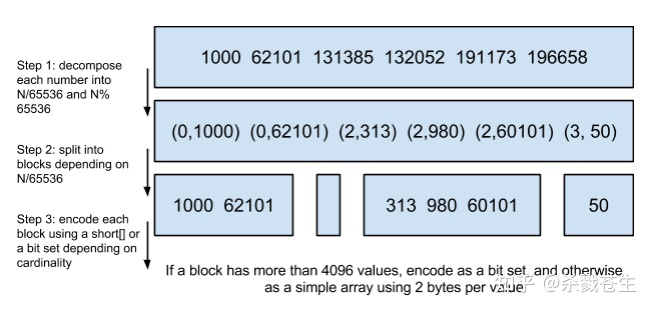

# 搜索引擎--倒排索引

## 倒排索引

 [搜索引擎之倒排索引及其底层算法 - 知乎](https://zhuanlan.zhihu.com/p/344550528) 

 [搜索引擎的query前缀匹配是怎么实现的？ - 知乎](https://www.zhihu.com/question/19921148) 

 [搜索引擎都在用的倒排索引——原理与实现 - 知乎](https://zhuanlan.zhihu.com/p/324378430) 

### ElasticSearch倒排索引

ElasticSearch是这样优化的，生成一张倒排表（Term），四个组成字段：

- Term :单词
- Term Index :数据（单词）索引
- Term Dictionary：数据（单词）字典。数据字典记录单词term
- Posting List：倒排列表。倒排列表记录了出现过某个单词的所有文档的文档列表及单词在该文档中出现的位置信息，每条记录称为一个倒排项(Posting)。根据倒排列表，即可获知哪些文档包含某个单词。

### FST

Finite State Transducer

FST中存储的是`<单词前缀，以该前缀开头的所有Term的压缩块在磁盘中的位置>`，即为前文提到的从 term index 查到对应的 term dictionary 的 block 位置之后，再去磁盘上找 term，大大减少了磁盘的 random access 次数。

## PostingList压缩算法

**PostingList用的两种算法**

- FOR压缩算法（Frame Of Reference）
- RBM算法（Roaring bitmaps）

### FOR

> 解释：
>
> 1. 假设PostingList 存储的指针位置集合为{73,300,302,332,343,372}
> 2. 根据上面的演示算法，如果直接存储指针集合需要的内存为24Bytes，占用空间太多，位置在磁盘空间中的位置不确定，太过零碎化。所以还需要优化。
> 3. 第一次优化：由原先的指针集合改为差值集合，73-0，300-73,302-300……，最后得到差值集合{73,227,2,30,11,29}，在磁盘中占用空间还是为24Bytes。
> 4. 第二次优化：切分成blocks，数组分开，计算出合适占用最小空间数量的blocks。注意：计算blocks，这块决定了后面的最快压缩和最小压缩两种压缩方式。
> 5. 上图切成两个blocks：[{73,227,2},{30,11,29}]。blocks-1，最大值为227，227<2^8,所以按照最大数227的8bit开辟空间，为3个8bit的空间来存储{73,227,2}。blocks-2，最大值为30，30<2^5,所以按照最大数30的5bit开辟空间，为3个8bit的空间来存储{30,11,29},为了后期计算压缩包大招，blocks前端加入4bit=1Byte空间存储blocks里面每个数值的占用的空间大小。
> 6. 最后24bytes压缩为7bytes

### RBM

 [Roaring Bitmaps : fast data structure for inverted indexes - by Amit Desai - Medium](https://medium.com/@amit.desai03/roaring-bitmaps-fast-data-structure-for-inverted-indexes-5490fa4d1b27) 

>  解释：
>
>  1. 假设PostingList 存储的指针位置集合为{1000,62101,131385,132052,191173,196658}
>
>  2. 大家观察会发现数值比较大，而且数值比较散列，就是使用差值，意味差值相差也比较大。最最重要的是数值大于65535。不适合使用FOR算法。
>
>  3. 将数值%65535，得到商值与膜值（余数），使用商值+膜值（余数）作为重构集合{(0,1000),(0,62101),(2,313),(2,980),(2,60101),(3,50)}
>
>     - 为什么要除以65535?
>
>       将0-32-bit [0, n) 内的数据劈成 高16位和低16位两部分数据。所以需要%2^16，也就是%65535
>
>  4. 将新的集合拆分成blocks。假设商值为key，膜值为value，相同key的value构成一个block。
>
>  5. 将block存储到容器中。目前有三种容器:
>
>     - ArrayContainer:存储位数低于16位的value，使用16bit的short数组存储，也就是2Bytes。
>     - BitmapContainer：底层为216bits的BitMap数据结构，容器大小固定为8KB。blocks里的元素数量大于4096更换容器为BitmapContainer
>     - RunContainer：Lucene5新增的特性，容器为8Bytes。底层为Run-Length Encoding算法
>

#### BitmapContainer

Q: 为什么使用两种数据结构来存储低16位的值：

- short数组：2bit * 4096 = 8KB
- BitMap：存储16位范围内数据 65536/8 = 8192b，

所以低于 4096个数，short 数组更省空间。

2^16/8

#### RunContainer

Run-length-encoding. 

> RLE takes input like `0000000000000000000011111111110000000000` and converts to 20(0),10(1),10(0). It counts repetitions and stores along with character. Now think of binary input, it only contains 0 and 1. Hence lot of repetitions and hence can save lot of space.

